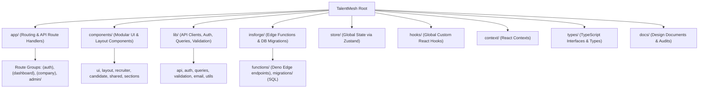
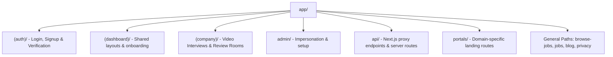
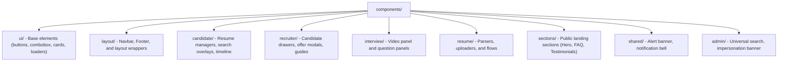
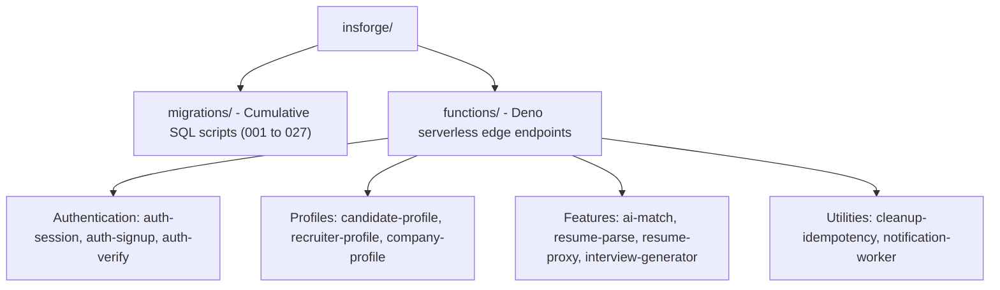
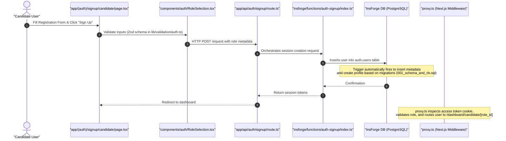
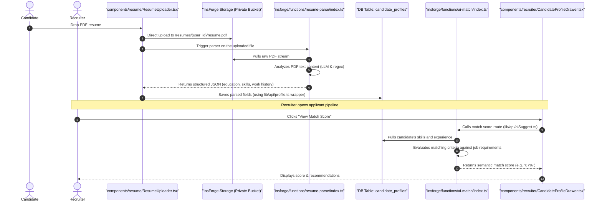
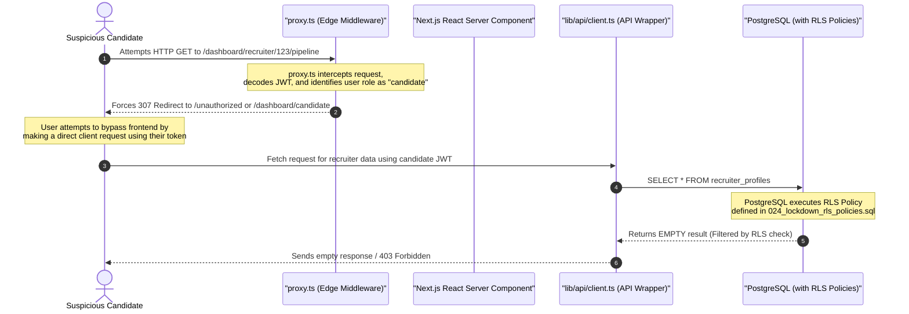

# TalentMesh — Project Directory & File Guide

Welcome to the **TalentMesh** project structure and directory guide. This document is designed for onboarding developers and provides a clear breakdown of every directory, subfolder, and key file in the codebase. It also visualizes how the different layers (Next.js frontend, library clients, Deno edge functions, and PostgreSQL database migrations) work together.

---

## 🗺️ High-Level Project Directory Map

The diagram below outlines the overall folder architecture of TalentMesh:

---

## 📁 Core Directory Breakdown

### 1. `app/` (Next.js 14 App Router)
The [app/](file:///c:/Users/Anuj/Desktop/Talentmesh-AI-Recruiting-/app) directory contains layouts, page templates, routing configurations, and Next.js backend Route Handlers (API endpoints). It is split into role-specific folders and Next.js Route Groups (indicated by parentheses) to keep concerns separated.

#### 📂 Routing Architecture

#### 🔑 Key Subdirectories & Files
* **[app/(auth)/](file:///c:/Users/Anuj/Desktop/Talentmesh-AI-Recruiting-/app/\(auth\))**: Logic and styles for authentication views.
  * [login/page.tsx](file:///c:/Users/Anuj/Desktop/Talentmesh-AI-Recruiting-/app/\(auth\)/login/page.tsx): The main login portal.
  * [signup/candidate/page.tsx](file:///c:/Users/Anuj/Desktop/Talentmesh-AI-Recruiting-/app/\(auth\)/signup/candidate/page.tsx): Multi-step candidate registration page.
  * [signup/recruiter/page.tsx](file:///c:/Users/Anuj/Desktop/Talentmesh-AI-Recruiting-/app/\(auth\)/signup/recruiter/page.tsx): Recruiter registration with document upload for KYC validation.
  * [forgot-password/page.tsx](file:///c:/Users/Anuj/Desktop/Talentmesh-AI-Recruiting-/app/\(auth\)/forgot-password/page.tsx): Password recovery page.
  * [reset-password/page.tsx](file:///c:/Users/Anuj/Desktop/Talentmesh-AI-Recruiting-/app/\(auth\)/reset-password/page.tsx): Session reset interface.
  * [pending-approval/page.tsx](file:///c:/Users/Anuj/Desktop/Talentmesh-AI-Recruiting-/app/\(auth\)/pending-approval/page.tsx): Landing page for recruiters who are awaiting KYC verification.
* **[app/(dashboard)/](file:///c:/Users/Anuj/Desktop/Talentmesh-AI-Recruiting-/app/\(dashboard\))**: Standard layout controls for authenticated candidates.
  * [candidate/onboarding/page.tsx](file:///c:/Users/Anuj/Desktop/Talentmesh-AI-Recruiting-/app/\(dashboard\)/candidate/onboarding/page.tsx): Stepper wizard for candidates to build their basic profiles upon registration.
* **[app/(company)/](file:///c:/Users/Anuj/Desktop/Talentmesh-AI-Recruiting-/app/\(company\))**: Interfaces for video interviews.
  * [interviews/\[id\]/room/page.tsx](file:///c:/Users/Anuj/Desktop/Talentmesh-AI-Recruiting-/app/\(company\)/interviews/%5Bid%5D/room/page.tsx): Virtual video interview room.
  * [interviews/\[id\]/review/page.tsx](file:///c:/Users/Anuj/Desktop/Talentmesh-AI-Recruiting-/app/\(company\)/interviews/%5Bid%5D/review/page.tsx): Evaluation dashboard for reviewing completed candidates.
* **[app/dashboard/](file:///c:/Users/Anuj/Desktop/Talentmesh-AI-Recruiting-/app/dashboard)**: Main dashboard directories.
  * **[candidate/\[role_id\]/](file:///c:/Users/Anuj/Desktop/Talentmesh-AI-Recruiting-/app/dashboard/candidate/%5Brole_id%5D)**: Dashboards protecting candidate pages:
    * `profile/page.tsx`: Full resume manager, education, experience, and skills editor.
    * `jobs/page.tsx`: Semantic job search and recommendations.
    * `applications/page.tsx`: Tracking job application pipelines and timeline details.
    * `interviews/page.tsx`: Scheduling and joining candidate interviews.
  * **[recruiter/\[role_id\]/](file:///c:/Users/Anuj/Desktop/Talentmesh-AI-Recruiting-/app/dashboard/recruiter/%5Brole_id%5D)**: Dashboards protecting recruiter pages:
    * `pipeline/page.tsx`: The ATS Kanban board. Allows dragging candidates across status categories.
    * `candidates/page.tsx`: Candidate search, parsing, and shortlisting dashboards.
    * `jobs/post-job/page.tsx`: Creating and submitting jobs for platform approval.
    * `interviews/page.tsx`: Recruiter scheduling and configuration for video channels.
  * **[admin/](file:///c:/Users/Anuj/Desktop/Talentmesh-AI-Recruiting-/app/dashboard/admin)**: Master administrator control panel.
    * `job-approvals/page.tsx`: Moderation dashboard to approve or reject recruiter job postings.
    * `impersonate/page.tsx`: Secure proxy page allowing admins to view the app as a candidate or recruiter.
    * `audit-logs/page.tsx`: Tracking activities (e.g., resume downloads, status updates).
* **[app/api/](file:///c:/Users/Anuj/Desktop/Talentmesh-AI-Recruiting-/app/api)**: Internal backend route handlers.
  * [api/auth/signup/route.ts](file:///c:/Users/Anuj/Desktop/Talentmesh-AI-Recruiting-/app/api/auth/signup/route.ts): Handles sign-up orchestration.
  * [api/impersonate/route.ts](file:///c:/Users/Anuj/Desktop/Talentmesh-AI-Recruiting-/app/api/impersonate/route.ts): Admin session token generation.
  * [api/storage/\[...path\]/route.ts](file:///c:/Users/Anuj/Desktop/Talentmesh-AI-Recruiting-/app/api/storage/%5B...path%5D/route.ts): Proxy for downloading private documents (e.g., resumes, KYC forms).
  * [api/email/send/route.ts](file:///c:/Users/Anuj/Desktop/Talentmesh-AI-Recruiting-/app/api/email/send/route.ts): Orchestration point for transactional emails.

---

### 2. `components/` (Modular UI Component Library)
The [components/](file:///c:/Users/Anuj/Desktop/Talentmesh-AI-Recruiting-/components) directory houses reusable React components. It is structured into UI primitives, layout wrappers, and feature-specific component folders.

#### 🔑 Key Subdirectories & Files
* **[components/ui/](file:///c:/Users/Anuj/Desktop/Talentmesh-AI-Recruiting-/components/ui)**: Ground-level Tailwind/CSS primitives.
  * [RichTextEditor.tsx](file:///c:/Users/Anuj/Desktop/Talentmesh-AI-Recruiting-/components/ui/RichTextEditor.tsx): Text formatting component for job descriptions.
  * [ContentCard/ContentCard.tsx](file:///c:/Users/Anuj/Desktop/Talentmesh-AI-Recruiting-/components/ui/ContentCard/ContentCard.tsx): Styled display containers.
  * [Marquee/Marquee.tsx](file:///c:/Users/Anuj/Desktop/Talentmesh-AI-Recruiting-/components/ui/Marquee/Marquee.tsx): Horizontal scrolling banner for client logos.
* **[components/candidate/](file:///c:/Users/Anuj/Desktop/Talentmesh-AI-Recruiting-/components/candidate)**: Core candidate features.
  * [ResumeManager.tsx](file:///c:/Users/Anuj/Desktop/Talentmesh-AI-Recruiting-/components/candidate/ResumeManager.tsx): Form interface to manage candidate resume files.
  * [ApplicationTimeline.tsx](file:///c:/Users/Anuj/Desktop/Talentmesh-AI-Recruiting-/components/candidate/ApplicationTimeline.tsx): Vertical step tracker representing hiring progress.
  * [ProfileStrengthWidget.tsx](file:///c:/Users/Anuj/Desktop/Talentmesh-AI-Recruiting-/components/candidate/ProfileStrengthWidget.tsx): Visual meter showing profile completeness.
* **[components/recruiter/](file:///c:/Users/Anuj/Desktop/Talentmesh-AI-Recruiting-/components/recruiter)**: ATS components.
  * [CandidateProfileDrawer.tsx](file:///c:/Users/Anuj/Desktop/Talentmesh-AI-Recruiting-/components/recruiter/CandidateProfileDrawer.tsx): Side panel displaying resume details, match score, and action triggers.
  * [CreateOfferModal.tsx](file:///c:/Users/Anuj/Desktop/Talentmesh-AI-Recruiting-/components/recruiter/CreateOfferModal.tsx): Workflow dialog to generate job offer letters.
* **[components/interview/](file:///c:/Users/Anuj/Desktop/Talentmesh-AI-Recruiting-/components/interview)**: Collaborative elements.
  * [InterviewRoom.tsx](file:///c:/Users/Anuj/Desktop/Talentmesh-AI-Recruiting-/components/interview/InterviewRoom.tsx): WebRTC video integration component.
  * [QuestionPanel.tsx](file:///c:/Users/Anuj/Desktop/Talentmesh-AI-Recruiting-/components/interview/QuestionPanel.tsx): Display list of questions/guides for the interviewer.
* **[components/resume/](file:///c:/Users/Anuj/Desktop/Talentmesh-AI-Recruiting-/components/resume)**: Upload & parse UI.
  * [ResumeUploader.tsx](file:///c:/Users/Anuj/Desktop/Talentmesh-AI-Recruiting-/components/resume/ResumeUploader.tsx): Drag-and-drop file uploader.
  * [ParseProgress.tsx](file:///c:/Users/Anuj/Desktop/Talentmesh-AI-Recruiting-/components/resume/ParseProgress.tsx): Visual indicator shown while Deno Edge parses file content.
  * [ResumeReview.tsx](file:///c:/Users/Anuj/Desktop/Talentmesh-AI-Recruiting-/components/resume/ResumeReview.tsx): Form confirming mapped fields from parse payload.

---

### 3. `lib/` (Application State, Helpers, Constants & API Connectors)
The [lib/](file:///c:/Users/Anuj/Desktop/Talentmesh-AI-Recruiting-/lib) folder acts as the core controller layer. It aggregates state context, constants, API client wrappers, and verification utilities.

#### 🔑 Key Subdirectories & Files
* **[lib/api/](file:///c:/Users/Anuj/Desktop/Talentmesh-AI-Recruiting-/lib/api)**: HTTP wrappers connecting client components to InsForge backend routes.
  * [client.ts](file:///c:/Users/Anuj/Desktop/Talentmesh-AI-Recruiting-/lib/api/client.ts): Orchestrates generic GET/POST/PUT/DELETE requests including auth context tokens.
  * [aiSuggest.ts](file:///c:/Users/Anuj/Desktop/Talentmesh-AI-Recruiting-/lib/api/aiSuggest.ts): Invokes edge functions to fetch candidate job matches.
  * [profile.ts](file:///c:/Users/Anuj/Desktop/Talentmesh-AI-Recruiting-/lib/api/profile.ts): Gets or updates profile details.
  * [jobs.ts](file:///c:/Users/Anuj/Desktop/Talentmesh-AI-Recruiting-/lib/api/jobs.ts): Fetches jobs, filters postings, and updates job stages.
* **[lib/auth/](file:///c:/Users/Anuj/Desktop/Talentmesh-AI-Recruiting-/lib/auth)**: Session authentication logic.
  * [AuthContext.tsx](file:///c:/Users/Anuj/Desktop/Talentmesh-AI-Recruiting-/lib/auth/AuthContext.tsx): Global React Context supplying candidate/recruiter session state to the browser.
  * [server-auth.ts](file:///c:/Users/Anuj/Desktop/Talentmesh-AI-Recruiting-/lib/auth/server-auth.ts): Token extraction library for Next.js Server Components.
* **[lib/queries/](file:///c:/Users/Anuj/Desktop/Talentmesh-AI-Recruiting-/lib/queries)**: React Query hooks.
  * [applications.ts](file:///c:/Users/Anuj/Desktop/Talentmesh-AI-Recruiting-/lib/queries/applications.ts): API cache layer for recruiters tracking applications.
  * [recommendations.ts](file:///c:/Users/Anuj/Desktop/Talentmesh-AI-Recruiting-/lib/queries/recommendations.ts): AI recommendation query hooks.
* **[lib/validation/](file:///c:/Users/Anuj/Desktop/Talentmesh-AI-Recruiting-/lib/validation)**: Forms and API validation rules using Zod.
  * [auth.ts](file:///c:/Users/Anuj/Desktop/Talentmesh-AI-Recruiting-/lib/validation/auth.ts): Validation schemas for sign-in/up configurations.
  * [jobs.ts](file:///c:/Users/Anuj/Desktop/Talentmesh-AI-Recruiting-/lib/validation/jobs.ts): Schema details validation constraints for job posts.
* **[lib/utils/](file:///c:/Users/Anuj/Desktop/Talentmesh-AI-Recruiting-/lib/utils)**: Utility helper libraries.
  * [profile-strength.ts](file:///c:/Users/Anuj/Desktop/Talentmesh-AI-Recruiting-/lib/utils/profile-strength.ts): Algorithms scoring profile completion.
  * [storage-url.ts](file:///c:/Users/Anuj/Desktop/Talentmesh-AI-Recruiting-/lib/utils/storage-url.ts): Generates secure URLs for files stored on InsForge.
* **[lib/constants/](file:///c:/Users/Anuj/Desktop/Talentmesh-AI-Recruiting-/lib/constants)**: System enums and constants.
  * [application-transitions.ts](file:///c:/Users/Anuj/Desktop/Talentmesh-AI-Recruiting-/lib/constants/application-transitions.ts): Validates state transitions in the ATS (e.g., `Applied` -> `Interviewing`).

---

### 4. `insforge/` (Serverless Edge Logic & Database Schemas)
The [insforge/](file:///c:/Users/Anuj/Desktop/Talentmesh-AI-Recruiting-/insforge) directory defines the backend. It contains raw SQL migrations that build the database schema and enforce Row Level Security (RLS) rules, along with TypeScript edge functions executing in a Deno environment.

#### 🔑 Key Subdirectories & Files
* **[insforge/migrations/](file:///c:/Users/Anuj/Desktop/Talentmesh-AI-Recruiting-/insforge/migrations)**: Sequential SQL updates.
  * `001_schema_and_rls.sql`: Initial setup creating tables for candidates, recruiters, and jobs.
  * `004_candidate_resumes.sql`: Introduces resume attachment support.
  * `011_resume_architecture.sql`: Re-architects database structures to support multiple candidate resumes.
  * `014_notification_queue.sql`: Schedules database alerts and worker pipelines.
  * `024_lockdown_rls_policies.sql` / `025_fix_rls_recursion.sql`: Hardens Row Level Security policies to prevent cross-tenant data leaks and infinite recursion.
* **[insforge/functions/](file:///c:/Users/Anuj/Desktop/Talentmesh-AI-Recruiting-/insforge/functions)**: Deno-based API routes.
  * `auth-signup/index.ts`: Triggered on database authentication to register users in the profiles table.
  * `ai-match/index.ts`: Semi-supervised evaluation matching a candidate's resume keywords to a job description.
  * `resume-parse/index.ts`: Edge function that parses PDF contents into structured profile fields.
  * `resume-proxy/index.ts`: Secure access controller checking permissions before streaming private resumes.
  * `notification-worker/index.ts`: Periodically runs in the background to handle email queues.

---

### 5. Other Key Directories
* **[hooks/](file:///c:/Users/Anuj/Desktop/Talentmesh-AI-Recruiting-/hooks)**: Global React hooks.
  * [useNetworkState.ts](file:///c:/Users/Anuj/Desktop/Talentmesh-AI-Recruiting-/hooks/useNetworkState.ts): Monitors connection status.
  * [useSessionRefresh.ts](file:///c:/Users/Anuj/Desktop/Talentmesh-AI-Recruiting-/hooks/useSessionRefresh.ts): Automatic cookie token renewal.
* **[context/](file:///c:/Users/Anuj/Desktop/Talentmesh-AI-Recruiting-/context)**: Global contexts.
  * [SearchContext.tsx](file:///c:/Users/Anuj/Desktop/Talentmesh-AI-Recruiting-/context/SearchContext.tsx): Manages criteria for universal searching.
* **[types/](file:///c:/Users/Anuj/Desktop/Talentmesh-AI-Recruiting-/types)**: TypeScript definitions.
  * [auth.ts](file:///c:/Users/Anuj/Desktop/Talentmesh-AI-Recruiting-/types/auth.ts): Interfaces for roles, claims, and sessions.
* **[store/](file:///c:/Users/Anuj/Desktop/Talentmesh-AI-Recruiting-/store)**: Zustand global UI stores.
  * [uiStore.ts](file:///c:/Users/Anuj/Desktop/Talentmesh-AI-Recruiting-/store/uiStore.ts): Manages state for the sidebar, modals, and panel displays.

### 6. Auxiliary & Tooling Directories
* **[__tests__/](file:///c:/Users/Anuj/Desktop/Talentmesh-AI-Recruiting-/__tests__)**: Unit and integration tests using Vitest (e.g., [uiStore.test.ts](file:///c:/Users/Anuj/Desktop/Talentmesh-AI-Recruiting-/__tests__/store/uiStore.test.ts) and [dashboard.test.ts](file:///c:/Users/Anuj/Desktop/Talentmesh-AI-Recruiting-/__tests__/validators/dashboard.test.ts)).
* **[e2e/](file:///c:/Users/Anuj/Desktop/Talentmesh-AI-Recruiting-/e2e)**: Playwright-based end-to-end tests validating key paths (e.g., recruiter setup, candidate onboarding, session governance, and notifications).
* **[scripts/](file:///c:/Users/Anuj/Desktop/Talentmesh-AI-Recruiting-/scripts)**: Node.js and TypeScript utility scripts for migrating schemas, initializing administrators, setting up platform settings, testing database policies, and pushing edge functions.
  * [deploy-all-functions.js](file:///c:/Users/Anuj/Desktop/Talentmesh-AI-Recruiting-/scripts/deploy-all-functions.js): Scaffolding tool to build and upload all functions to the Deno-based edge framework.
  * [apply-all-migrations.ts](file:///c:/Users/Anuj/Desktop/Talentmesh-AI-Recruiting-/scripts/apply-all-migrations.ts): Integrates sequence migrations directly into the production database.
* **[supabase/](file:///c:/Users/Anuj/Desktop/Talentmesh-AI-Recruiting-/supabase)**: Houses secondary/legacy serverless functions (like `approve-recruiter` and `process-access-request`).
* **[public/](file:///c:/Users/Anuj/Desktop/Talentmesh-AI-Recruiting-/public)**: Static assets, icons, logos, manifests, and mock blueprints.
* **[audits/](file:///c:/Users/Anuj/Desktop/Talentmesh-AI-Recruiting-/audits)**: Documented evaluation files that evaluate compliance, RLS rules, and overall production readiness.
* **[docs/](file:///c:/Users/Anuj/Desktop/Talentmesh-AI-Recruiting-/docs)**: Architectural designs, backlog files, and authorization workflows.

---

## 🔗 How Files Work Together (System Workflows)

Here are the detailed flowcharts visualizing how files, directories, and components interact to execute core features.

### 🔐 Workflow A: User Sign Up & Role Assignment
This diagram traces how a user signs up as a Candidate, showing how the frontend, api routes, edge functions, and database migrations work together:

---

### 📄 Workflow B: Resume Upload, Parsing & Job Matching
This diagram traces how a candidate uploads a resume, how the Deno parser processes it, and how the recruiter matches it against jobs:

---

### 🛡️ Workflow C: Impersonation & Security Guard Flow
This diagram illustrates how Next.js Middleware (`proxy.ts`), Server Actions, and database Row Level Security (RLS) policies work together to secure data:

---

## 🛠️ Configuration & Environment Reference
The project relies on these core configuration files at the root of the workspace:
* **[package.json](file:///c:/Users/Anuj/Desktop/Talentmesh-AI-Recruiting-/package.json)**: Declares application dependencies (Next.js 14, Zustand, Tailwind 3.4) and deployment scripts.
* **[tsconfig.json](file:///c:/Users/Anuj/Desktop/Talentmesh-AI-Recruiting-/tsconfig.json)**: Mappings for absolute path imports (e.g., `@/components/*`).
* **[next.config.ts](file:///c:/Users/Anuj/Desktop/Talentmesh-AI-Recruiting-/next.config.ts)**: Configures image domain whitelists (for logos and uploads) and compilation optimizations.
* **[proxy.ts](file:///c:/Users/Anuj/Desktop/Talentmesh-AI-Recruiting-/proxy.ts)**: Next.js Edge Middleware guarding routes and performing JWT checks.
* **[tailwind.config.ts](file:///c:/Users/Anuj/Desktop/Talentmesh-AI-Recruiting-/tailwind.config.ts)**: Specifies theme values, color configurations, and component paths.
* **[playwright.config.ts](file:///c:/Users/Anuj/Desktop/Talentmesh-AI-Recruiting-/playwright.config.ts)**: Sets environment details and browser matrices for E2E tests.
* **[vitest.config.ts](file:///c:/Users/Anuj/Desktop/Talentmesh-AI-Recruiting-/vitest.config.ts)**: Sets up the runner environment for unit tests.
