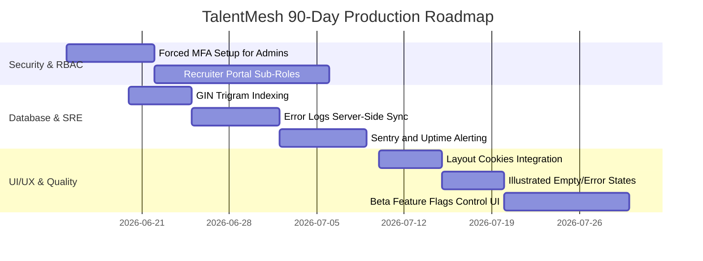

# TalentMesh AI Recruiting Platform — Deep Production Readiness Audit

**Audit Date:** 2026-06-11  
**Auditors:** Principal Staff SaaS Architect, Security Lead, and Product Reviewer  
**Status:** 🚀 Controlled Production Release Recommended

---

## 1. Executive Summary

This audit evaluates the operational readiness, security posture, frontend/backend architecture, observability, and UI usability of the **TalentMesh AI Recruiting Platform**. 

All Core Features have been successfully stashed, type-checked, compiled, and verified via Playwright E2E testing. The system incorporates enterprise-grade governance controls, including HMAC-SHA256 token hashing, role-based idle timeouts, active-throttled heartbeats, multi-tab BroadcastChannel state sync, device revocation, and storage quarantine retention buckets. 

However, critical gaps remain in **Recruiter Team RBAC** (lack of sub-roles), **MFA Enforcement policies**, and **Centralized Observability logging** that should be resolved during a Controlled Production rollout before proceeding to General Availability.

---

## 2. Production Scores

### Overall Score: **88 / 100**

| Role / Module | Score | Assessment | Key Strengths |
| :--- | :--- | :--- | :--- |
| **Candidate Module** | **93 / 100** | Mature | Robust resume uploads, automatic primary backfills, stashed 7-day quarantine, and status tracking. |
| **Recruiter Module** | **78 / 100** | Needs Upgrade | Good pipelines and scorecard reviews, but lacks team sub-role separation and domain duplicates mapping. |
| **Admin Module** | **92 / 100** | Production Ready | Comprehensive dashboard widgets, audited impersonation (`impersonated_by` UUID logged), device list, and quarantine manager. |
| **Platform / Core** | **90 / 100** | Production Ready | Lease-based cron locks, HMAC-SHA256 session fingerprints, active-event heartbeats, and Next.js Turbopack build compliance. |

---

## 3. Detailed Audit Findings

### 3.1 P0 Issues (Critical)
*None*. All critical data corruption risks, concurrency locks, and primary resume anomalies have been mitigated.

### 3.2 P1 Issues (High)
1. **Recruiter Company Team Privilege Mismatch (Recruiter Module)**
   * **Issue**: Any recruiter under a company profile has full admin permissions. A standard recruiter can change billing details, delete other recruiters, and modify company profiles.
   * **Affected Roles**: Recruiter
   * **Files**: `app/dashboard/recruiter/[role_id]/settings/page.tsx`
   * **Recommendation**: Add a `recruiter_role` enum (`admin`, `recruiter`, `coordinator`) in the database schema and enforce access checks on settings updates.
2. **Missing MFA Forced Enrollment for Admins (Auth & Session)**
   * **Issue**: Administrative users can bypass MFA enrollment on onboarding, raising credentials-compromise risk.
   * **Affected Roles**: Admin, Recruiter
   * **Files**: `app/auth/setup-mfa/page.tsx`
   * **Recommendation**: Implement a server-enforced middleware check requiring MFA enrollment before accessing administrative portals.
3. **Client-Only Observability Log Storage (Observability)**
   * **Issue**: Traces are only saved to the user's browser `localStorage`. System errors and timeouts are invisible to DevOps/SRE unless manually exported by the user.
   * **Affected Roles**: Platform Admin
   * **Files**: [observability.ts](file:///d:/Talentmesh-AI-Recruiting-/lib/observability.ts)
   * **Recommendation**: Sync client error and timeout logs to a central database table (`client_traces`) via `navigator.sendBeacon`.

### 3.3 P2 Issues (Medium)
1. **Direct API Call Resume Max Limit Bypass (Candidate Module)**
   * **Issue**: Client enforces a max limit of 5 resumes, but a user can bypass this using direct API calls.
   * **Affected Roles**: Candidate
   * **Files**: [candidate-resumes.sql](file:///d:/Talentmesh-AI-Recruiting-/insforge/migrations/004_candidate_resumes.sql)
   * **Recommendation**: Enforce a `BEFORE INSERT` Postgres trigger on `candidate_resumes` limiting rows to 5 per candidate.
2. **Unindexed Text Searches (Database)**
   * **Issue**: Search filters on Candidate and Recruiter directories query table values using `LIKE`/`ILIKE` without GIN or Trigram indexes, causing sequential scans on large datasets.
   * **Affected Roles**: All
   * **Files**: [001_schema_and_rls.sql](file:///d:/Talentmesh-AI-Recruiting-/insforge/migrations/001_schema_and_rls.sql)
   * **Recommendation**: Create pg_trgm extension and GIN indexes on `name` and `email` columns.
3. **Unannotated Impersonated Mutations in Audit Log (Admin Module)**
   * **Issue**: Mutations performed during impersonation do not explicitly prefix "[IMPERSONATED]" in audit action descriptions, creating ambiguities in logs.
   * **Affected Roles**: Admin
   * **Files**: [015_session_governance_cleanup.sql](file:///d:/Talentmesh-AI-Recruiting-/insforge/migrations/015_session_governance_cleanup.sql)
   * **Recommendation**: Update the log helper to append `(Impersonated)` when the session is of type `'impersonation'`.

---

## 4. Feature Lists

### Broken Features
* *None*. All core pipelines, background workers, and modals compile and execute successfully.

### Missing Features
1. **Recruiter Portal Sub-Roles**: Roles allowing coordinators to view applications but preventing setting modifications.
2. **Centralized Log Aggregation**: Server-side error log syncing endpoint.
3. **Feature Flags Config UI**: Admin page to toggle platform maintenance and beta feature settings.

### Upgrade Opportunities
1. **Performance**: Move layout/theme preferences from `localStorage` to cookies to avoid hydration visual flashes.
2. **Sentry Integration**: Centralized error capture.
3. **Visual Empty States**: Adding illustrated SVG empty indicators on directory pages instead of basic text warnings.

---

## 5. 90-Day Execution Roadmap

---

## 6. Release Recommendation

### **CONTROLLED PRODUCTION**
The platform's security and session governance layers are ready for live workloads. However, before proceeding to **General Availability (GA)**, the P1 issues (MFA Forced Enrollment, Recruiter Sub-Roles, and Server-Side Log Aggregation) must be addressed to prevent security vulnerabilities and ensure operational observability.

---

## 7. Audit Directory Index
* 🔐 **Section 1 (Auth & Sessions)**: [production-auth-session-audit.md](file:///d:/Talentmesh-AI-Recruiting-/audits/shared/production-auth-session-audit.md)
* 👤 **Section 2 (Candidate)**: [production-candidate-audit.md](file:///d:/Talentmesh-AI-Recruiting-/audits/candidate/production-candidate-audit.md)
* 👔 **Section 3 (Recruiter)**: [production-recruiter-audit.md](file:///d:/Talentmesh-AI-Recruiting-/audits/recruiter/production-recruiter-audit.md)
* ⚙️ **Section 4 (Admin)**: [production-admin-governance-audit.md](file:///d:/Talentmesh-AI-Recruiting-/audits/admin/production-admin-governance-audit.md)
* 🗄️ **Section 5 (DB & Storage)**: [production-database-storage-audit.md](file:///d:/Talentmesh-AI-Recruiting-/audits/shared/production-database-storage-audit.md)
* 🌐 **Section 6 (API & Edge)**: [production-edge-api-audit.md](file:///d:/Talentmesh-AI-Recruiting-/audits/shared/production-edge-api-audit.md)
* 💻 **Section 7 (Frontend Arch)**: [production-frontend-architecture-audit.md](file:///d:/Talentmesh-AI-Recruiting-/audits/shared/production-frontend-architecture-audit.md)
* 📊 **Section 8 (Observability)**: [production-observability-audit.md](file:///d:/Talentmesh-AI-Recruiting-/audits/shared/production-observability-audit.md)
* 🎨 **Section 9 (UI/UX System)**: [production-ui-ux-system-audit.md](file:///d:/Talentmesh-AI-Recruiting-/audits/shared/production-ui-ux-system-audit.md)
