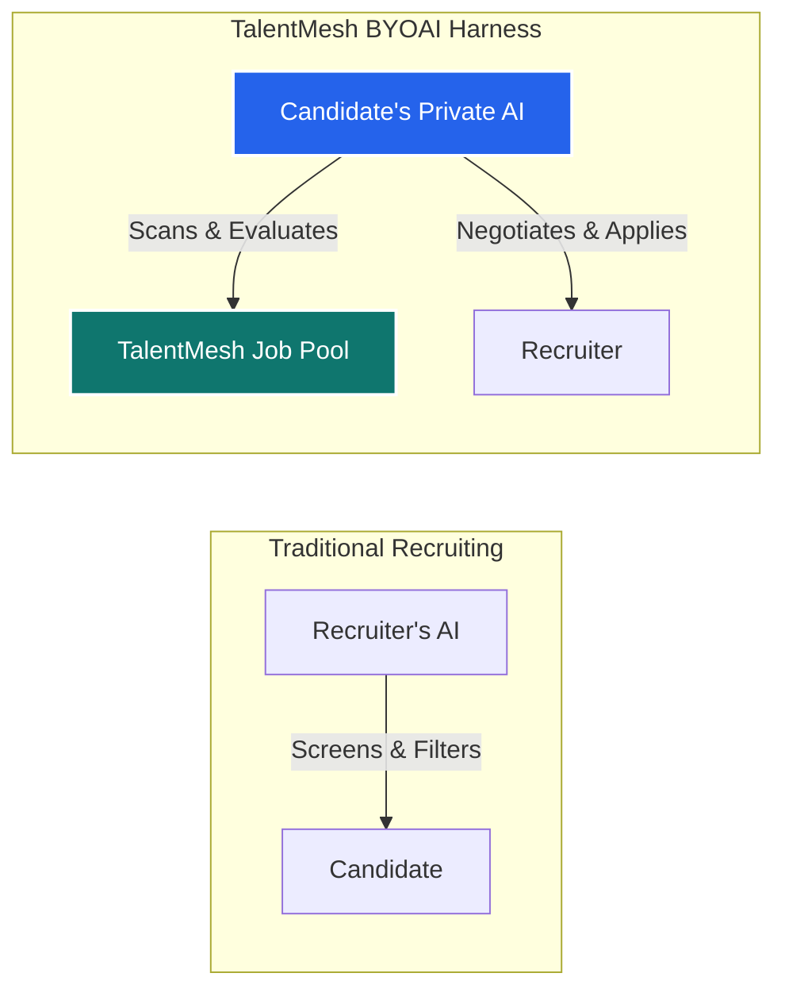

# 🤖 Bring Your Own AI (BYOAI): Candidate Harness Proposal

This document outlines the conceptual design for integrating a **"Bring Your Own AI/Agent" (BYOAI)** harness for candidates on the **TalentMesh** platform. 

Instead of traditional recruiting systems where AI is solely used by companies to filter and screen applicants, TalentMesh will act as an open framework (a **"harness"**) allowing candidates to connect their own private AI agents. These agents will act as their fiduciary representatives—evaluating roles according to their personal work styles, deep preferences, and career goals.

---

## 💡 The Core Philosophy: Turning the Table on AI Screening



In the current TalentMesh implementation, job matching is recruiter-centric: recruiters run an `ai-match` function that scores candidates. By enabling BYOAI:
1. **Candidates gain agency:** Their own AI reads their resume and personal criteria, scanning the TalentMesh job index to find the most aligned positions.
2. **True alignment:** The candidate's AI evaluates soft parameters (e.g., work-life balance, asynchronous workflow, team culture, code quality) that standard search filters miss.
3. **Zero backend costs:** By executing matches client-side or directing requests to user-provided keys, TalentMesh saves massive amounts in LLM infrastructure costs.

---

## 🛠️ How It Works: The Harness Architecture

TalentMesh acts as the **Harness** (data access + authentication layer) while the candidate provides the **Brain** (API key, model parameters, or webhook endpoint).

### 1. The Connection Layer (BYO-Brain)
Candidates can connect their AI in two ways:
* **API Key Integration (No Code)**: Input keys from OpenAI, Anthropic, Gemini, or OpenRouter. These keys are stored encrypted in the database or held purely in browser session storage for maximum privacy.
* **Agent Webhook (Advanced Developers)**: Provide a custom HTTPS POST URL (e.g., pointing to an Autogen, CrewAI, or LangChain agent running locally or on Vercel/Fly.io).

### 2. The Harness API
TalentMesh exposes a set of read-only endpoints protected by the candidate's existing JWT session:
* `GET /api/candidate/jobs/stream`: Exposes structured JSONs of approved job posts containing detailed parameters:
  ```json
  {
    "id": "job-uuid",
    "title": "Senior React Developer",
    "company": "TechCorp",
    "description": "...",
    "tech_stack": ["React", "Next.js", "Zustand"],
    "salary_range": "$120,000 - $140,000",
    "work_style": "Async-first, remote, core hours 10am-2pm EST",
    "team_culture": "Engineering-led, flat hierarchy, documentation heavy"
  }
  ```
* `POST /api/candidate/jobs/:id/apply`: Endpoint allowing the candidate's agent to submit the application with an agent-generated personal pitch.

---

## 🔑 Proposed Database Schema

To support BYOAI, we would introduce a new configuration table to store credentials and preferences securely.

```sql
-- Table to manage candidate AI configurations
CREATE TABLE candidate_ai_config (
    id UUID PRIMARY KEY DEFAULT gen_random_uuid(),
    candidate_id UUID NOT NULL REFERENCES candidate_profiles(id) ON DELETE CASCADE,
    provider VARCHAR(50) NOT NULL, -- 'openai', 'anthropic', 'openrouter', 'custom_webhook'
    api_key_encrypted TEXT,        -- Nullable if user prefers client-side LocalStorage
    webhook_url TEXT,              -- For custom developer agents
    system_prompt TEXT,            -- Candidate's work rules: e.g. "I want remote, async-first, React roles..."
    temperature NUMERIC DEFAULT 0.2,
    created_at TIMESTAMP WITH TIME ZONE DEFAULT timezone('utc'::text, now()) NOT NULL,
    updated_at TIMESTAMP WITH TIME ZONE DEFAULT timezone('utc'::text, now()) NOT NULL,
    
    CONSTRAINT unique_candidate_ai UNIQUE (candidate_id)
);

-- Enable Row Level Security (RLS) on the configuration
ALTER TABLE candidate_ai_config ENABLE ROW LEVEL SECURITY;

-- Candidates can only view/edit their own AI config
CREATE POLICY "Candidates can manage their own AI config" 
    ON candidate_ai_config 
    FOR ALL 
    USING (auth.uid() = candidate_id)
    WITH CHECK (auth.uid() = candidate_id);
```

---

## ✨ Features Enabled by BYOAI

### 1. The "Reverse Match Score" (The My-Way Meter)
On the [browse-jobs page](file:///c:/Users/Anuj/Desktop/Talentmesh-AI-Recruiting-/app/browse-jobs/page.tsx), instead of showing a static match score, candidates see a personalized score calculated by *their* AI:
* **UI Component**: A custom widget on the Job Details page displaying:
  * 🟢 **"My AI Match: 94%"**
  * **Agent Summary**: *"This role matches your requirement for TypeScript and remote async work. Note: Their description mentions occasional weekend rotations, which goes against your preferred strict 4-day or 40-hour week."*

### 2. Auto-Draft Tailored Applications
When the candidate clicks "Apply", their connected agent is prompted with:
* The candidate's parsed resume (skills, background, projects).
* The target job description and company details.
* The agent drafts a tailored cover letter explaining precisely how the candidate fits this job's unique constraints, ensuring a highly customized, high-quality application.

### 3. Agent Webhooks for Automated Search
For developer candidates:
* Every time a recruiter posts a new job that meets basic criteria, TalentMesh sends a webhook payload to the candidate's custom agent URL.
* The agent analyzes it. If it approves, it automatically triggers a API callback to TalentMesh to:
  1. Save the job.
  2. Send a notification to the candidate: *"Hey, I found a matching job at TechCorp! I drafted an application. Click here to approve and submit."*

### 4. Interactive Interview Co-Pilot
* Before joining an interview on TalentMesh, the candidate can chat with their own AI, which has digested the company's background, the interviewer's role, and the job requirements.
* It generates mock questions, suggests answers reflecting the candidate's authentic background, and gives tips on negotiating.

---

## 🔒 Security & Privacy Guidelines

1. **API Key Safety**:
   * **Option A (Zero-trust/Client-only)**: We never store the candidate's API key on our database. The key is stored in the browser's `sessionStorage` or `localStorage`. Requests to OpenAI/Anthropic are made directly from the client's browser, meaning TalentMesh servers never see the key.
   * **Option B (Server-side execution)**: If stored in the DB, keys are encrypted using PostgreSQL `pgcrypto` with a secret key derived from the user's password/JWT.
2. **Access Control**:
   * Recruiters have **no access** to the candidate's AI settings or configuration. The configuration remains 100% private to the candidate.
   * The candidate's agent is only allowed to access public job postings and the candidate's own profile. It cannot scan other users' profiles.
