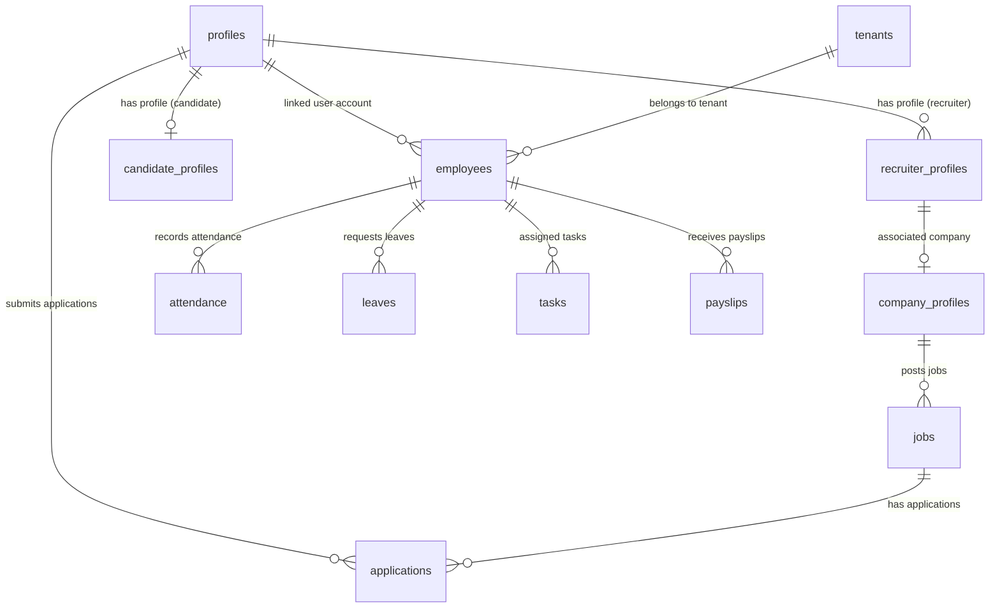

# TalentMesh Database Schema Documentation

This document provides a comprehensive overview of the database schema of the TalentMesh AI Recruitment and Multi-Tenant HR Management platform. The schema is verified against the live InsForge PostgreSQL database.

## 1. System Architecture & Domains

The TalentMesh system is divided into two primary domains that share a central identity system:

1. **Recruitment & Job Portal (Candidate-Facing)**: Handles candidate signups, profiles, resumes, job listings, applications, and recruiter requests.
2. **Multi-Tenant HR Management Portal (Employee-Facing)**: Handles employee records, shifts, attendance, leaves, payroll, tasks, and communications within distinct corporate tenants.

### High-Level System Overview (ERD)

## 2. Table Schemas By Domain

### 2.1 Recruitment & Job Portal (Candidate-Facing)

These tables manage candidate profiles, resumes, job listings, and applications.

#### profiles

| Column | Data Type | Nullable | Key | Default | Notes |
|---|---|---|---|---|---|
| `id` | `uuid` | NO | 🔑 PK | NULL | Unique identifier |
| `name` | `text` | YES |  | NULL |  |
| `email` | `text` | YES |  | NULL |  |
| `role` | `text` | YES |  | `'candidate'::text` |  |
| `avatar_url` | `text` | YES |  | NULL |  |
| `location` | `text` | YES |  | NULL |  |
| `phone` | `text` | YES |  | NULL |  |
| `bio` | `text` | YES |  | NULL |  |
| `company_id` | `uuid` | YES |  | NULL |  |
| `is_active` | `boolean` | YES |  | `true` |  |
| `mfa_enabled` | `boolean` | YES |  | `false` |  |
| `completed_onboarding` | `boolean` | YES |  | `false` |  |
| `onboarding_step` | `integer` | YES |  | `0` |  |
| `password_set_at` | `timestamp with time zone` | YES |  | NULL |  |
| `created_at` | `timestamp with time zone` | YES |  | `now()` | Record creation timestamp |
| `updated_at` | `timestamp with time zone` | YES |  | `now()` | Record modification timestamp |
| `role_id` | `text` | YES |  | NULL |  |
| `status` | `text` | YES |  | NULL |  |

#### candidate_profiles

| Column | Data Type | Nullable | Key | Default | Notes |
|---|---|---|---|---|---|
| `id` | `uuid` | NO | 🔑 PK | NULL | Unique identifier |
| `headline` | `text` | YES |  | NULL |  |
| `skills` | `ARRAY` | YES |  | NULL |  |
| `experience_years` | `numeric` | YES |  | NULL |  |
| `education` | `jsonb` | YES |  | NULL |  |
| `work_history` | `jsonb` | YES |  | NULL |  |
| `resume_url` | `text` | YES |  | NULL |  |
| `profile_strength` | `integer` | YES |  | `0` |  |
| `linkedin_url` | `text` | YES |  | NULL |  |
| `github_url` | `text` | YES |  | NULL |  |
| `portfolio_url` | `text` | YES |  | NULL |  |
| `salary_min` | `numeric` | YES |  | NULL |  |
| `salary_max` | `numeric` | YES |  | NULL |  |
| `currency` | `text` | YES |  | `'INR'::text` |  |
| `preferred_locations` | `ARRAY` | YES |  | NULL |  |
| `is_visible` | `boolean` | YES |  | `true` |  |
| `job_types` | `ARRAY` | YES |  | NULL |  |
| `open_to_remote` | `boolean` | YES |  | `false` |  |
| `created_at` | `timestamp with time zone` | YES |  | `now()` | Record creation timestamp |
| `updated_at` | `timestamp with time zone` | YES |  | `now()` | Record modification timestamp |
| `primary_resume_id` | `uuid` | YES | 🔗 FK (→ `candidate_resumes.id`) | NULL | References candidate_resumes |
| `is_discoverable` | `boolean` | YES |  | `true` |  |

#### candidate_resumes

| Column | Data Type | Nullable | Key | Default | Notes |
|---|---|---|---|---|---|
| `id` | `uuid` | NO | 🔑 PK | `gen_random_uuid()` | Unique identifier |
| `candidate_id` | `uuid` | YES | 🔗 FK (→ `profiles.id`) | NULL | References profiles |
| `label` | `text` | NO |  | NULL |  |
| `file_url` | `text` | NO |  | NULL |  |
| `file_name` | `text` | NO |  | NULL |  |
| `file_size_bytes` | `bigint` | YES |  | NULL |  |
| `is_default` | `boolean` | YES |  | `false` |  |
| `upload_count` | `integer` | YES |  | `1` |  |
| `created_at` | `timestamp with time zone` | YES |  | `now()` | Record creation timestamp |
| `updated_at` | `timestamp with time zone` | YES |  | `now()` | Record modification timestamp |

#### recruiter_profiles

| Column | Data Type | Nullable | Key | Default | Notes |
|---|---|---|---|---|---|
| `id` | `uuid` | NO | 🔑 PK | `gen_random_uuid()` | Unique identifier |
| `user_id` | `uuid` | YES | 🔗 FK (→ `profiles.id`) | NULL | Link to user account / profile |
| `company_name` | `text` | YES |  | NULL |  |
| `industry` | `text` | YES |  | NULL |  |
| `company_size` | `text` | YES |  | NULL |  |
| `is_approved` | `boolean` | YES |  | `false` |  |
| `website_url` | `text` | YES |  | NULL |  |
| `linkedin_url` | `text` | YES |  | NULL |  |
| `about` | `text` | YES |  | NULL |  |
| `status` | `text` | YES |  | `'pending'::text` |  |
| `created_at` | `timestamp with time zone` | YES |  | `now()` | Record creation timestamp |
| `updated_at` | `timestamp with time zone` | YES |  | `now()` | Record modification timestamp |
| `document_url` | `text` | YES |  | NULL |  |

#### company_profiles

| Column | Data Type | Nullable | Key | Default | Notes |
|---|---|---|---|---|---|
| `id` | `uuid` | NO | 🔑 PK | `gen_random_uuid()` | Unique identifier |
| `recruiter_id` | `uuid` | YES | 🔗 FK (→ `profiles.id`) | NULL | References profiles |
| `name` | `text` | YES |  | NULL |  |
| `logo_url` | `text` | YES |  | NULL |  |
| `about` | `text` | YES |  | NULL |  |
| `website` | `text` | YES |  | NULL |  |
| `industry` | `text` | YES |  | NULL |  |
| `gstin` | `text` | YES |  | NULL |  |
| `tan` | `text` | YES |  | NULL |  |
| `kyc_documents` | `jsonb` | YES |  | NULL |  |
| `created_at` | `timestamp with time zone` | YES |  | `now()` | Record creation timestamp |
| `updated_at` | `timestamp with time zone` | YES |  | `now()` | Record modification timestamp |

#### jobs

| Column | Data Type | Nullable | Key | Default | Notes |
|---|---|---|---|---|---|
| `id` | `uuid` | NO | 🔑 PK | `gen_random_uuid()` | Unique identifier |
| `recruiter_id` | `uuid` | YES | 🔗 FK (→ `profiles.id`) | NULL | References profiles |
| `company_id` | `uuid` | YES | 🔗 FK (→ `company_profiles.id`) | NULL | References company_profiles |
| `title` | `text` | YES |  | NULL |  |
| `description` | `text` | YES |  | NULL |  |
| `requirements` | `ARRAY` | YES |  | NULL |  |
| `skills_required` | `ARRAY` | YES |  | NULL |  |
| `location` | `text` | YES |  | NULL |  |
| `type` | `text` | YES |  | NULL |  |
| `department` | `text` | YES |  | NULL |  |
| `salary_min` | `integer` | YES |  | NULL |  |
| `salary_max` | `integer` | YES |  | NULL |  |
| `currency` | `text` | YES |  | `'INR'::text` |  |
| `experience_min` | `integer` | YES |  | NULL |  |
| `experience_max` | `integer` | YES |  | NULL |  |
| `status` | `text` | YES |  | `'draft'::text` |  |
| `is_approved` | `boolean` | YES |  | `false` |  |
| `views_count` | `integer` | YES |  | `0` |  |
| `applications_count` | `integer` | YES |  | `0` |  |
| `created_at` | `timestamp with time zone` | YES |  | `now()` | Record creation timestamp |
| `updated_at` | `timestamp with time zone` | YES |  | `now()` | Record modification timestamp |

#### applications

| Column | Data Type | Nullable | Key | Default | Notes |
|---|---|---|---|---|---|
| `id` | `uuid` | NO | 🔑 PK | `gen_random_uuid()` | Unique identifier |
| `job_id` | `uuid` | YES | 🔗 FK (→ `jobs.id`) | NULL | References jobs |
| `candidate_id` | `uuid` | YES | 🔗 FK (→ `profiles.id`) | NULL | References profiles |
| `status` | `text` | YES |  | `'applied'::text` |  |
| `cover_letter` | `text` | YES |  | NULL |  |
| `applied_at` | `timestamp with time zone` | YES |  | `now()` |  |
| `created_at` | `timestamp with time zone` | YES |  | `now()` | Record creation timestamp |
| `updated_at` | `timestamp with time zone` | YES |  | `now()` | Record modification timestamp |
| `apply_type` | `text` | YES |  | `'quick'::text` |  |
| `screening_answers` | `jsonb` | YES |  | NULL |  |
| `resume_id` | `uuid` | YES | 🔗 FK (→ `candidate_resumes.id`) | NULL | References candidate_resumes |
| `resume_snapshot_key` | `text` | YES |  | NULL |  |

#### application_status_history

| Column | Data Type | Nullable | Key | Default | Notes |
|---|---|---|---|---|---|
| `id` | `uuid` | NO | 🔑 PK | `gen_random_uuid()` | Unique identifier |
| `application_id` | `uuid` | NO | 🔗 FK (→ `applications.id`) | NULL | References applications |
| `from_status` | `text` | YES |  | NULL |  |
| `to_status` | `text` | NO |  | NULL |  |
| `changed_by` | `uuid` | YES | 🔗 FK (→ `profiles.id`) | NULL | References profiles |
| `actor_type` | `text` | YES |  | NULL |  |
| `metadata` | `jsonb` | YES |  | `'{}'::jsonb` |  |
| `note` | `text` | YES |  | NULL |  |
| `changed_at` | `timestamp with time zone` | YES |  | `now()` |  |

#### application_events

| Column | Data Type | Nullable | Key | Default | Notes |
|---|---|---|---|---|---|
| `id` | `uuid` | NO | 🔑 PK | `gen_random_uuid()` | Unique identifier |
| `application_id` | `uuid` | YES | 🔗 FK (→ `applications.id`) | NULL | References applications |
| `event_type` | `text` | YES |  | NULL |  |
| `created_at` | `timestamp with time zone` | YES |  | `now()` | Record creation timestamp |

#### custom_proposals

| Column | Data Type | Nullable | Key | Default | Notes |
|---|---|---|---|---|---|
| `id` | `uuid` | NO | 🔑 PK | `gen_random_uuid()` | Unique identifier |
| `recruiter_id` | `uuid` | YES | 🔗 FK (→ `profiles.id`) | NULL | References profiles |
| `features` | `jsonb` | NO |  | NULL |  |
| `price` | `numeric` | NO |  | NULL |  |
| `status` | `text` | YES |  | `'pending'::text` |  |
| `created_at` | `timestamp with time zone` | YES |  | `now()` | Record creation timestamp |
| `updated_at` | `timestamp with time zone` | YES |  | `now()` | Record modification timestamp |

#### resume_access_log

| Column | Data Type | Nullable | Key | Default | Notes |
|---|---|---|---|---|---|
| `id` | `uuid` | NO | 🔑 PK | `gen_random_uuid()` | Unique identifier |
| `application_id` | `uuid` | YES | 🔗 FK (→ `applications.id`) | NULL | References applications |
| `candidate_id` | `uuid` | YES | 🔗 FK (→ `profiles.id`) | NULL | References profiles |
| `recruiter_id` | `uuid` | YES | 🔗 FK (→ `profiles.id`) | NULL | References profiles |
| `access_type` | `text` | NO |  | NULL |  |
| `source` | `text` | YES |  | `'application'::text` |  |
| `created_at` | `timestamp with time zone` | YES |  | `now()` | Record creation timestamp |

#### job_alerts

| Column | Data Type | Nullable | Key | Default | Notes |
|---|---|---|---|---|---|
| `id` | `uuid` | NO | 🔑 PK | `gen_random_uuid()` | Unique identifier |
| `candidate_id` | `uuid` | YES | 🔗 FK (→ `profiles.id`) | NULL | References profiles |
| `alert_name` | `text` | YES |  | NULL |  |
| `search_query_json` | `jsonb` | YES |  | NULL |  |
| `created_at` | `timestamp with time zone` | YES |  | `now()` | Record creation timestamp |
| `updated_at` | `timestamp with time zone` | YES |  | `now()` | Record modification timestamp |

#### nvites

| Column | Data Type | Nullable | Key | Default | Notes |
|---|---|---|---|---|---|
| `id` | `uuid` | NO | 🔑 PK | `gen_random_uuid()` | Unique identifier |
| `job_id` | `uuid` | YES | 🔗 FK (→ `jobs.id`) | NULL | References jobs |
| `candidate_id` | `uuid` | YES | 🔗 FK (→ `profiles.id`) | NULL | References profiles |
| `recruiter_id` | `uuid` | YES | 🔗 FK (→ `profiles.id`) | NULL | References profiles |
| `message` | `text` | YES |  | NULL |  |
| `status` | `text` | YES |  | `'pending'::text` |  |
| `sent_at` | `timestamp with time zone` | YES |  | `now()` |  |
| `viewed_at` | `timestamp with time zone` | YES |  | NULL |  |
| `created_at` | `timestamp with time zone` | YES |  | `now()` | Record creation timestamp |
| `updated_at` | `timestamp with time zone` | YES |  | `now()` | Record modification timestamp |

#### ai_suggestion_cache

| Column | Data Type | Nullable | Key | Default | Notes |
|---|---|---|---|---|---|
| `query_key` | `text` | NO | 🔑 PK | NULL |  |
| `suggestions` | `jsonb` | NO |  | NULL |  |
| `expires_at` | `timestamp with time zone` | NO |  | NULL |  |
| `created_at` | `timestamp with time zone` | YES |  | `now()` | Record creation timestamp |

### 2.2 Multi-Tenant HR Management Portal

These tables govern company tenants, employee records, shifts, attendance, leaves, tasks, and payroll.

#### tenants

| Column | Data Type | Nullable | Key | Default | Notes |
|---|---|---|---|---|---|
| `id` | `uuid` | NO | 🔑 PK | `gen_random_uuid()` | Unique identifier |
| `company_name` | `text` | NO |  | NULL |  |
| `subdomain` | `text` | NO |  | NULL |  |
| `plan` | `text` | NO |  | `'trial'::text` |  |
| `status` | `text` | NO |  | `'trial'::text` |  |
| `timezone` | `text` | NO |  | `'Asia/Kolkata'::text` |  |
| `punch_in_start` | `time without time zone` | NO |  | `'09:00:00'::time without time zone` |  |
| `punch_in_cutoff` | `time without time zone` | NO |  | `'10:30:00'::time without time zone` |  |
| `work_hours_per_day` | `numeric` | NO |  | `8` |  |
| `lunch_break_minutes` | `integer` | NO |  | `60` |  |
| `punch_out_gate_enabled` | `boolean` | NO |  | `true` |  |
| `max_employees` | `integer` | NO |  | `25` |  |
| `logo_url` | `text` | YES |  | NULL |  |
| `created_at` | `timestamp with time zone` | NO |  | `now()` | Record creation timestamp |
| `updated_at` | `timestamp with time zone` | NO |  | `now()` | Record modification timestamp |

#### tenant_settings

| Column | Data Type | Nullable | Key | Default | Notes |
|---|---|---|---|---|---|
| `id` | `uuid` | NO | 🔑 PK | `gen_random_uuid()` | Unique identifier |
| `tenant_id` | `uuid` | NO | 🔗 FK (→ `tenants.id`) | NULL | Multi-tenant isolation identifier |
| `key` | `text` | NO |  | NULL |  |
| `value` | `text` | NO |  | NULL |  |
| `updated_at` | `timestamp with time zone` | NO |  | `now()` | Record modification timestamp |

#### employees

| Column | Data Type | Nullable | Key | Default | Notes |
|---|---|---|---|---|---|
| `id` | `uuid` | NO | 🔑 PK | `gen_random_uuid()` | Unique identifier |
| `user_id` | `uuid` | YES |  | NULL | Link to user account / profile |
| `full_name` | `text` | NO |  | NULL |  |
| `email` | `text` | NO |  | NULL |  |
| `phone` | `text` | YES |  | NULL |  |
| `date_of_birth` | `date` | YES |  | NULL |  |
| `gender` | `text` | YES |  | NULL |  |
| `address` | `text` | YES |  | NULL |  |
| `city` | `text` | YES |  | NULL |  |
| `state` | `text` | YES |  | NULL |  |
| `pincode` | `text` | YES |  | NULL |  |
| `department` | `text` | YES |  | NULL |  |
| `designation` | `text` | YES |  | NULL |  |
| `employee_code` | `text` | YES |  | NULL |  |
| `date_of_joining` | `date` | YES |  | NULL |  |
| `employment_type` | `text` | YES |  | NULL |  |
| `status` | `text` | NO |  | `'active'::text` |  |
| `aadhaar_number` | `text` | YES |  | NULL |  |
| `pan_number` | `text` | YES |  | NULL |  |
| `bank_name` | `text` | YES |  | NULL |  |
| `account_number` | `text` | YES |  | NULL |  |
| `ifsc_code` | `text` | YES |  | NULL |  |
| `emergency_contact_name` | `text` | YES |  | NULL |  |
| `emergency_contact_phone` | `text` | YES |  | NULL |  |
| `emergency_contact_relation` | `text` | YES |  | NULL |  |
| `profile_photo_url` | `text` | YES |  | NULL |  |
| `created_by` | `uuid` | YES | 🔗 FK (→ `employees.id`) | NULL | References employees |
| `created_at` | `timestamp with time zone` | NO |  | `now()` | Record creation timestamp |
| `updated_at` | `timestamp with time zone` | NO |  | `now()` | Record modification timestamp |
| `role` | `USER-DEFINED` | YES |  | `'employee'::user_role` |  |
| `tenant_id` | `uuid` | NO | 🔗 FK (→ `tenants.id`) | `'c3816de9-2222-49d0-842b-8e99613c635a'::uuid` | Multi-tenant isolation identifier |
| `work_mode` | `text` | NO |  | `'office'::text` |  |

#### shifts

| Column | Data Type | Nullable | Key | Default | Notes |
|---|---|---|---|---|---|
| `id` | `uuid` | NO | 🔑 PK | `gen_random_uuid()` | Unique identifier |
| `tenant_id` | `uuid` | NO | 🔗 FK (→ `tenants.id`) | NULL | Multi-tenant isolation identifier |
| `name` | `text` | NO |  | NULL |  |
| `start_time` | `time without time zone` | NO |  | NULL |  |
| `end_time` | `time without time zone` | NO |  | NULL |  |
| `working_days` | `ARRAY` | NO |  | `'{1,2,3,4,5,6}'::integer[]` |  |
| `half_day_cutoff_override` | `time without time zone` | YES |  | NULL |  |
| `is_default` | `boolean` | NO |  | `false` |  |
| `is_active` | `boolean` | NO |  | `true` |  |
| `created_at` | `timestamp with time zone` | NO |  | `now()` | Record creation timestamp |
| `updated_at` | `timestamp with time zone` | NO |  | `now()` | Record modification timestamp |
| `punch_in_opens_minutes_before` | `integer` | YES |  | `60` |  |
| `late_mark_grace_override` | `integer` | YES |  | NULL |  |

#### employee_shifts

| Column | Data Type | Nullable | Key | Default | Notes |
|---|---|---|---|---|---|
| `id` | `uuid` | NO | 🔑 PK | `gen_random_uuid()` | Unique identifier |
| `tenant_id` | `uuid` | NO | 🔗 FK (→ `tenants.id`) | NULL | Multi-tenant isolation identifier |
| `employee_id` | `uuid` | NO | 🔗 FK (→ `employees.id`) | NULL | References employees |
| `shift_id` | `uuid` | NO | 🔗 FK (→ `shifts.id`) | NULL | References shifts |
| `effective_from` | `date` | NO |  | `CURRENT_DATE` |  |
| `effective_to` | `date` | YES |  | NULL |  |
| `created_at` | `timestamp with time zone` | NO |  | `now()` | Record creation timestamp |

#### attendance

| Column | Data Type | Nullable | Key | Default | Notes |
|---|---|---|---|---|---|
| `id` | `uuid` | NO | 🔑 PK | `gen_random_uuid()` | Unique identifier |
| `employee_id` | `uuid` | NO | 🔗 FK (→ `employees.id`) | NULL | References employees |
| `date` | `date` | NO |  | NULL |  |
| `punch_in` | `timestamp with time zone` | YES |  | `now()` |  |
| `punch_out` | `timestamp with time zone` | YES |  | NULL |  |
| `punch_out_allowed` | `boolean` | NO |  | `false` |  |
| `punch_in_ip` | `text` | YES |  | NULL |  |
| `punch_out_ip` | `text` | YES |  | NULL |  |
| `work_hours` | `numeric` | YES |  | NULL |  |
| `status` | `text` | NO |  | `'present'::text` |  |
| `notes` | `text` | YES |  | NULL |  |
| `created_at` | `timestamp with time zone` | NO |  | `now()` | Record creation timestamp |
| `tenant_id` | `uuid` | NO | 🔗 FK (→ `tenants.id`) | `'c3816de9-2222-49d0-842b-8e99613c635a'::uuid` | Multi-tenant isolation identifier |
| `punch_in_lat` | `numeric` | YES |  | NULL |  |
| `punch_in_lng` | `numeric` | YES |  | NULL |  |
| `punch_in_location_accuracy` | `numeric` | YES |  | NULL |  |
| `punch_in_location_status` | `text` | YES |  | NULL |  |
| `punch_out_lat` | `numeric` | YES |  | NULL |  |
| `punch_out_lng` | `numeric` | YES |  | NULL |  |
| `punch_out_location_accuracy` | `numeric` | YES |  | NULL |  |
| `punch_out_location_status` | `text` | YES |  | NULL |  |
| `is_late` | `boolean` | YES |  | `false` |  |
| `session_status` | `text` | YES |  | `'open'::text` |  |
| `auto_closed` | `boolean` | YES |  | `false` |  |
| `total_break_minutes` | `integer` | NO |  | `0` |  |
| `current_break_id` | `uuid` | YES | 🔗 FK (→ `attendance_breaks.id`) | NULL | References attendance_breaks |
| `current_break_start` | `timestamp with time zone` | YES |  | NULL |  |
| `location_accuracy` | `numeric` | YES |  | NULL |  |
| `location_confidence` | `text` | YES |  | NULL |  |
| `location_status` | `text` | YES |  | NULL |  |
| `remote_exception_id` | `uuid` | YES |  | NULL |  |
| `verification_snapshot` | `jsonb` | YES |  | NULL |  |

#### attendance_breaks

| Column | Data Type | Nullable | Key | Default | Notes |
|---|---|---|---|---|---|
| `id` | `uuid` | NO | 🔑 PK | `gen_random_uuid()` | Unique identifier |
| `tenant_id` | `uuid` | NO | 🔗 FK (→ `tenants.id`) | NULL | Multi-tenant isolation identifier |
| `employee_id` | `uuid` | NO | 🔗 FK (→ `employees.id`) | NULL | References employees |
| `attendance_id` | `uuid` | NO | 🔗 FK (→ `attendance.id`) | NULL | References attendance |
| `break_type` | `text` | NO |  | NULL |  |
| `started_at` | `timestamp with time zone` | NO |  | `now()` |  |
| `ended_at` | `timestamp with time zone` | YES |  | NULL |  |
| `duration_minutes` | `integer` | YES |  | NULL |  |
| `over_limit_minutes` | `integer` | YES |  | `0` |  |
| `created_at` | `timestamp with time zone` | NO |  | `now()` | Record creation timestamp |

#### attendance_selfies

| Column | Data Type | Nullable | Key | Default | Notes |
|---|---|---|---|---|---|
| `id` | `uuid` | NO | 🔑 PK | `gen_random_uuid()` | Unique identifier |
| `attendance_id` | `uuid` | NO | 🔗 FK (→ `attendance.id`) | NULL | References attendance |
| `tenant_id` | `uuid` | NO | 🔗 FK (→ `tenants.id`) | NULL | Multi-tenant isolation identifier |
| `employee_id` | `uuid` | NO | 🔗 FK (→ `employees.id`) | NULL | References employees |
| `type` | `text` | NO |  | NULL |  |
| `storage_path` | `text` | NO |  | NULL |  |
| `captured_at` | `timestamp with time zone` | NO |  | `now()` |  |
| `created_at` | `timestamp with time zone` | NO |  | `now()` | Record creation timestamp |

#### attendance_audit_logs

| Column | Data Type | Nullable | Key | Default | Notes |
|---|---|---|---|---|---|
| `id` | `uuid` | NO | 🔑 PK | `gen_random_uuid()` | Unique identifier |
| `tenant_id` | `uuid` | NO | 🔗 FK (→ `tenants.id`) | NULL | Multi-tenant isolation identifier |
| `attendance_id` | `uuid` | NO | 🔗 FK (→ `attendance.id`) | NULL | References attendance |
| `action` | `text` | NO |  | NULL |  |
| `details` | `jsonb` | YES |  | NULL |  |
| `performed_by` | `uuid` | YES |  | NULL |  |
| `created_at` | `timestamp with time zone` | YES |  | `now()` | Record creation timestamp |

#### attendance_corrections

| Column | Data Type | Nullable | Key | Default | Notes |
|---|---|---|---|---|---|
| `id` | `uuid` | NO | 🔑 PK | `gen_random_uuid()` | Unique identifier |
| `tenant_id` | `uuid` | NO | 🔗 FK (→ `tenants.id`) | NULL | Multi-tenant isolation identifier |
| `employee_id` | `uuid` | NO | 🔗 FK (→ `employees.id`) | NULL | References employees |
| `attendance_date` | `date` | NO |  | NULL |  |
| `requested_punch_in` | `time without time zone` | YES |  | NULL |  |
| `requested_punch_out` | `time without time zone` | YES |  | NULL |  |
| `reason` | `text` | NO |  | NULL |  |
| `status` | `text` | NO |  | `'pending'::text` |  |
| `reviewed_by` | `uuid` | YES | 🔗 FK (→ `employees.id`) | NULL | References employees |
| `reviewed_at` | `timestamp with time zone` | YES |  | NULL |  |
| `rejection_reason` | `text` | YES |  | NULL |  |
| `created_at` | `timestamp with time zone` | NO |  | `now()` | Record creation timestamp |

#### attendance_location_exceptions

| Column | Data Type | Nullable | Key | Default | Notes |
|---|---|---|---|---|---|
| `id` | `uuid` | NO | 🔑 PK | `gen_random_uuid()` | Unique identifier |
| `tenant_id` | `uuid` | NO | 🔗 FK (→ `tenants.id`) | NULL | Multi-tenant isolation identifier |
| `employee_id` | `uuid` | NO | 🔗 FK (→ `employees.id`) | NULL | References employees |
| `exception_type` | `text` | NO |  | NULL |  |
| `start_date` | `date` | NO |  | NULL |  |
| `end_date` | `date` | NO |  | NULL |  |
| `reason` | `text` | NO |  | NULL |  |
| `status` | `text` | NO |  | `'pending'::text` |  |
| `requested_by` | `uuid` | YES | 🔗 FK (→ `employees.id`) | NULL | References employees |
| `approved_by` | `uuid` | YES | 🔗 FK (→ `employees.id`) | NULL | References employees |
| `approved_at` | `timestamp with time zone` | YES |  | NULL |  |
| `cancelled_by` | `uuid` | YES | 🔗 FK (→ `employees.id`) | NULL | References employees |
| `cancelled_at` | `timestamp with time zone` | YES |  | NULL |  |
| `created_at` | `timestamp with time zone` | NO |  | `now()` | Record creation timestamp |
| `updated_at` | `timestamp with time zone` | NO |  | `now()` | Record modification timestamp |

#### office_locations

| Column | Data Type | Nullable | Key | Default | Notes |
|---|---|---|---|---|---|
| `id` | `uuid` | NO | 🔑 PK | `gen_random_uuid()` | Unique identifier |
| `tenant_id` | `uuid` | NO | 🔗 FK (→ `tenants.id`) | NULL | Multi-tenant isolation identifier |
| `name` | `text` | NO |  | NULL |  |
| `lat` | `numeric` | NO |  | NULL |  |
| `lng` | `numeric` | NO |  | NULL |  |
| `radius_meters` | `integer` | NO |  | `500` |  |
| `is_active` | `boolean` | NO |  | `true` |  |
| `created_at` | `timestamp with time zone` | YES |  | `now()` | Record creation timestamp |
| `updated_at` | `timestamp with time zone` | YES |  | `now()` | Record modification timestamp |

#### holidays

| Column | Data Type | Nullable | Key | Default | Notes |
|---|---|---|---|---|---|
| `id` | `uuid` | NO | 🔑 PK | `gen_random_uuid()` | Unique identifier |
| `name` | `text` | NO |  | NULL |  |
| `date` | `date` | NO |  | NULL |  |
| `type` | `text` | YES |  | NULL |  |
| `description` | `text` | YES |  | NULL |  |
| `created_at` | `timestamp with time zone` | NO |  | `now()` | Record creation timestamp |
| `tenant_id` | `uuid` | NO | 🔗 FK (→ `tenants.id`) | `'c3816de9-2222-49d0-842b-8e99613c635a'::uuid` | Multi-tenant isolation identifier |

#### hr_policies

| Column | Data Type | Nullable | Key | Default | Notes |
|---|---|---|---|---|---|
| `id` | `uuid` | NO | 🔑 PK | `gen_random_uuid()` | Unique identifier |
| `title` | `text` | NO |  | NULL |  |
| `description` | `text` | YES |  | NULL |  |
| `file_url` | `text` | NO |  | NULL |  |
| `file_name` | `text` | YES |  | NULL |  |
| `uploaded_by` | `uuid` | YES | 🔗 FK (→ `employees.id`) | NULL | References employees |
| `visible_to` | `text` | NO |  | `'all'::text` |  |
| `department_filter` | `text` | YES |  | NULL |  |
| `created_at` | `timestamp with time zone` | NO |  | `now()` | Record creation timestamp |
| `updated_at` | `timestamp with time zone` | NO |  | `now()` | Record modification timestamp |
| `tenant_id` | `uuid` | NO | 🔗 FK (→ `tenants.id`) | `'c3816de9-2222-49d0-842b-8e99613c635a'::uuid` | Multi-tenant isolation identifier |

#### employee_documents

| Column | Data Type | Nullable | Key | Default | Notes |
|---|---|---|---|---|---|
| `id` | `uuid` | NO | 🔑 PK | `gen_random_uuid()` | Unique identifier |
| `tenant_id` | `uuid` | NO | 🔗 FK (→ `tenants.id`) | NULL | Multi-tenant isolation identifier |
| `employee_id` | `uuid` | NO | 🔗 FK (→ `employees.id`) | NULL | References employees |
| `file_name` | `text` | NO |  | NULL |  |
| `file_url` | `text` | NO |  | NULL |  |
| `file_key` | `text` | NO |  | NULL |  |
| `size` | `integer` | NO |  | NULL |  |
| `uploaded_at` | `timestamp with time zone` | NO |  | `now()` |  |

#### tasks

| Column | Data Type | Nullable | Key | Default | Notes |
|---|---|---|---|---|---|
| `id` | `uuid` | NO | 🔑 PK | `gen_random_uuid()` | Unique identifier |
| `title` | `text` | NO |  | NULL |  |
| `description` | `text` | YES |  | NULL |  |
| `assigned_to` | `uuid` | NO | 🔗 FK (→ `employees.id`) | NULL | References employees |
| `assigned_by` | `uuid` | NO | 🔗 FK (→ `employees.id`) | NULL | References employees |
| `department_filter` | `text` | YES |  | NULL |  |
| `priority` | `text` | NO |  | `'medium'::text` |  |
| `due_date` | `date` | YES |  | NULL |  |
| `due_time` | `time without time zone` | YES |  | NULL |  |
| `status` | `text` | NO |  | `'assigned'::text` |  |
| `created_at` | `timestamp with time zone` | NO |  | `now()` | Record creation timestamp |
| `updated_at` | `timestamp with time zone` | NO |  | `now()` | Record modification timestamp |
| `tenant_id` | `uuid` | NO | 🔗 FK (→ `tenants.id`) | `'c3816de9-2222-49d0-842b-8e99613c635a'::uuid` | Multi-tenant isolation identifier |
| `attendance_lock_date` | `date` | YES |  | NULL |  |
| `auto_red_marked_at` | `timestamp with time zone` | YES |  | NULL |  |

#### task_submissions

| Column | Data Type | Nullable | Key | Default | Notes |
|---|---|---|---|---|---|
| `id` | `uuid` | NO | 🔑 PK | `gen_random_uuid()` | Unique identifier |
| `task_id` | `uuid` | NO | 🔗 FK (→ `tasks.id`) | NULL | References tasks |
| `employee_id` | `uuid` | NO | 🔗 FK (→ `employees.id`) | NULL | References employees |
| `notes` | `text` | YES |  | NULL |  |
| `attachment_url` | `text` | YES |  | NULL |  |
| `attachment_name` | `text` | YES |  | NULL |  |
| `submitted_at` | `timestamp with time zone` | NO |  | `now()` |  |
| `reviewed_by` | `uuid` | YES | 🔗 FK (→ `employees.id`) | NULL | References employees |
| `reviewed_at` | `timestamp with time zone` | YES |  | NULL |  |
| `review_notes` | `text` | YES |  | NULL |  |
| `status` | `text` | NO |  | `'pending'::text` |  |
| `submission_type` | `text` | YES |  | `'general'::text` |  |
| `candidate_name` | `text` | YES |  | NULL |  |
| `resume_url` | `text` | YES |  | NULL |  |
| `resume_name` | `text` | YES |  | NULL |  |
| `recruitment_notes` | `text` | YES |  | NULL |  |
| `metrics` | `jsonb` | YES |  | `'{}'::jsonb` |  |
| `tenant_id` | `uuid` | NO | 🔗 FK (→ `tenants.id`) | `'c3816de9-2222-49d0-842b-8e99613c635a'::uuid` | Multi-tenant isolation identifier |

#### calendar_events

| Column | Data Type | Nullable | Key | Default | Notes |
|---|---|---|---|---|---|
| `id` | `uuid` | NO | 🔑 PK | `gen_random_uuid()` | Unique identifier |
| `employee_id` | `uuid` | NO | 🔗 FK (→ `employees.id`) | NULL | References employees |
| `date` | `date` | NO |  | NULL |  |
| `type` | `text` | YES |  | NULL |  |
| `task_id` | `uuid` | YES | 🔗 FK (→ `tasks.id`) | NULL | References tasks |
| `notes` | `text` | YES |  | NULL |  |
| `created_at` | `timestamp with time zone` | NO |  | `now()` | Record creation timestamp |
| `tenant_id` | `uuid` | NO | 🔗 FK (→ `tenants.id`) | `'c3816de9-2222-49d0-842b-8e99613c635a'::uuid` | Multi-tenant isolation identifier |

#### leaves

| Column | Data Type | Nullable | Key | Default | Notes |
|---|---|---|---|---|---|
| `id` | `uuid` | NO | 🔑 PK | `gen_random_uuid()` | Unique identifier |
| `employee_id` | `uuid` | NO | 🔗 FK (→ `employees.id`) | NULL | References employees |
| `leave_type` | `text` | YES |  | NULL |  |
| `start_date` | `date` | NO |  | NULL |  |
| `end_date` | `date` | NO |  | NULL |  |
| `total_days` | `integer` | YES |  | NULL |  |
| `reason` | `text` | NO |  | NULL |  |
| `status` | `text` | NO |  | `'pending'::text` |  |
| `reviewed_by` | `uuid` | YES | 🔗 FK (→ `employees.id`) | NULL | References employees |
| `reviewed_at` | `timestamp with time zone` | YES |  | NULL |  |
| `rejection_reason` | `text` | YES |  | NULL |  |
| `applied_at` | `timestamp with time zone` | NO |  | `now()` |  |
| `tenant_id` | `uuid` | NO | 🔗 FK (→ `tenants.id`) | `'c3816de9-2222-49d0-842b-8e99613c635a'::uuid` | Multi-tenant isolation identifier |
| `leave_type_id` | `uuid` | YES | 🔗 FK (→ `leave_types.id`) | NULL | References leave_types |
| `approved_business_days` | `integer` | YES |  | NULL |  |

#### leave_types

| Column | Data Type | Nullable | Key | Default | Notes |
|---|---|---|---|---|---|
| `id` | `uuid` | NO | 🔑 PK | `gen_random_uuid()` | Unique identifier |
| `tenant_id` | `uuid` | NO | 🔗 FK (→ `tenants.id`) | NULL | Multi-tenant isolation identifier |
| `name` | `text` | NO |  | NULL |  |
| `code` | `text` | NO |  | NULL |  |
| `days_per_year` | `numeric` | NO |  | `0` |  |
| `accrual_type` | `text` | NO |  | `'lump_sum'::text` |  |
| `carry_forward_enabled` | `boolean` | NO |  | `false` |  |
| `carry_forward_max_days` | `numeric` | NO |  | `0` |  |
| `encashment_enabled` | `boolean` | NO |  | `false` |  |
| `applicable_from_day` | `integer` | NO |  | `0` |  |
| `probation_restricted` | `boolean` | NO |  | `false` |  |
| `requires_document` | `boolean` | NO |  | `false` |  |
| `min_notice_days` | `integer` | NO |  | `0` |  |
| `max_consecutive_days` | `integer` | YES |  | NULL |  |
| `is_active` | `boolean` | NO |  | `true` |  |
| `sort_order` | `integer` | NO |  | `0` |  |
| `created_at` | `timestamp with time zone` | NO |  | `now()` | Record creation timestamp |
| `updated_at` | `timestamp with time zone` | NO |  | `now()` | Record modification timestamp |
| `is_paid` | `boolean` | NO |  | `true` |  |

#### leave_balances

| Column | Data Type | Nullable | Key | Default | Notes |
|---|---|---|---|---|---|
| `id` | `uuid` | NO | 🔑 PK | `gen_random_uuid()` | Unique identifier |
| `tenant_id` | `uuid` | NO | 🔗 FK (→ `tenants.id`) | NULL | Multi-tenant isolation identifier |
| `employee_id` | `uuid` | NO | 🔗 FK (→ `employees.id`) | NULL | References employees |
| `leave_type_id` | `uuid` | NO | 🔗 FK (→ `leave_types.id`) | NULL | References leave_types |
| `year` | `integer` | NO |  | NULL |  |
| `total_allocated` | `numeric` | NO |  | `0` |  |
| `carried_forward` | `numeric` | NO |  | `0` |  |
| `used_days` | `numeric` | NO |  | `0` |  |
| `pending_days` | `numeric` | NO |  | `0` |  |
| `balance` | `numeric` | NO |  | `0` |  |
| `last_accrual_date` | `date` | YES |  | NULL |  |
| `updated_at` | `timestamp with time zone` | NO |  | `now()` | Record modification timestamp |

#### payroll_runs

| Column | Data Type | Nullable | Key | Default | Notes |
|---|---|---|---|---|---|
| `id` | `uuid` | NO | 🔑 PK | `gen_random_uuid()` | Unique identifier |
| `tenant_id` | `uuid` | NO | 🔗 FK (→ `tenants.id`) | NULL | Multi-tenant isolation identifier |
| `month` | `integer` | NO |  | NULL |  |
| `year` | `integer` | NO |  | NULL |  |
| `status` | `text` | NO |  | `'draft'::text` |  |
| `total_gross` | `numeric` | YES |  | NULL |  |
| `total_deductions` | `numeric` | YES |  | NULL |  |
| `total_net` | `numeric` | YES |  | NULL |  |
| `employee_count` | `integer` | YES |  | NULL |  |
| `run_by` | `uuid` | YES | 🔗 FK (→ `employees.id`) | NULL | References employees |
| `approved_by` | `uuid` | YES | 🔗 FK (→ `employees.id`) | NULL | References employees |
| `approved_at` | `timestamp with time zone` | YES |  | NULL |  |
| `paid_at` | `timestamp with time zone` | YES |  | NULL |  |
| `notes` | `text` | YES |  | NULL |  |
| `created_at` | `timestamp with time zone` | YES |  | `now()` | Record creation timestamp |

#### payslips

| Column | Data Type | Nullable | Key | Default | Notes |
|---|---|---|---|---|---|
| `id` | `uuid` | NO | 🔑 PK | `gen_random_uuid()` | Unique identifier |
| `tenant_id` | `uuid` | NO | 🔗 FK (→ `tenants.id`) | NULL | Multi-tenant isolation identifier |
| `payroll_run_id` | `uuid` | NO | 🔗 FK (→ `payroll_runs.id`) | NULL | References payroll_runs |
| `employee_id` | `uuid` | NO | 🔗 FK (→ `employees.id`) | NULL | References employees |
| `month` | `integer` | NO |  | NULL |  |
| `year` | `integer` | NO |  | NULL |  |
| `days_in_month` | `integer` | NO |  | NULL |  |
| `working_days` | `integer` | NO |  | NULL |  |
| `days_present` | `integer` | NO |  | NULL |  |
| `days_absent` | `integer` | NO |  | NULL |  |
| `days_on_leave` | `integer` | NO |  | NULL |  |
| `half_days` | `integer` | NO |  | `0` |  |
| `basic_monthly` | `numeric` | NO |  | NULL |  |
| `hra_monthly` | `numeric` | NO |  | NULL |  |
| `special_allowance` | `numeric` | NO |  | NULL |  |
| `other_allowances` | `numeric` | NO |  | NULL |  |
| `gross_salary` | `numeric` | NO |  | NULL |  |
| `pf_employee` | `numeric` | NO |  | `0` |  |
| `pf_employer` | `numeric` | NO |  | `0` |  |
| `esi_employee` | `numeric` | NO |  | `0` |  |
| `esi_employer` | `numeric` | NO |  | `0` |  |
| `tds` | `numeric` | NO |  | `0` |  |
| `other_deductions` | `numeric` | NO |  | `0` |  |
| `total_deductions` | `numeric` | NO |  | NULL |  |
| `net_payable` | `numeric` | NO |  | NULL |  |
| `pdf_url` | `text` | YES |  | NULL |  |
| `emailed_at` | `timestamp with time zone` | YES |  | NULL |  |
| `created_at` | `timestamp with time zone` | YES |  | `now()` | Record creation timestamp |
| `policy_snapshot` | `jsonb` | YES |  | NULL |  |

#### salary_structures

| Column | Data Type | Nullable | Key | Default | Notes |
|---|---|---|---|---|---|
| `id` | `uuid` | NO | 🔑 PK | `gen_random_uuid()` | Unique identifier |
| `tenant_id` | `uuid` | NO | 🔗 FK (→ `tenants.id`) | NULL | Multi-tenant isolation identifier |
| `employee_id` | `uuid` | NO | 🔗 FK (→ `employees.id`) | NULL | References employees |
| `effective_from` | `date` | NO |  | NULL |  |
| `ctc_annual` | `numeric` | NO |  | NULL |  |
| `basic_percent` | `numeric` | NO |  | `40` |  |
| `hra_percent` | `numeric` | NO |  | `50` |  |
| `special_allowance` | `numeric` | NO |  | `0` |  |
| `pf_applicable` | `boolean` | NO |  | `true` |  |
| `esi_applicable` | `boolean` | NO |  | `false` |  |
| `tds_monthly` | `numeric` | NO |  | `0` |  |
| `other_allowances` | `numeric` | NO |  | `0` |  |
| `created_by` | `uuid` | YES | 🔗 FK (→ `employees.id`) | NULL | References employees |
| `created_at` | `timestamp with time zone` | YES |  | `now()` | Record creation timestamp |

#### overtime_records

| Column | Data Type | Nullable | Key | Default | Notes |
|---|---|---|---|---|---|
| `id` | `uuid` | NO | 🔑 PK | `gen_random_uuid()` | Unique identifier |
| `tenant_id` | `uuid` | NO | 🔗 FK (→ `tenants.id`) | NULL | Multi-tenant isolation identifier |
| `employee_id` | `uuid` | NO | 🔗 FK (→ `employees.id`) | NULL | References employees |
| `attendance_id` | `uuid` | NO | 🔗 FK (→ `attendance.id`) | NULL | References attendance |
| `date` | `date` | NO |  | NULL |  |
| `regular_hours` | `numeric` | NO |  | NULL |  |
| `overtime_hours` | `numeric` | NO |  | `0` |  |
| `overtime_rate` | `numeric` | NO |  | `1.5` |  |
| `overtime_amount` | `numeric` | YES |  | NULL |  |
| `approved` | `boolean` | NO |  | `false` |  |
| `approved_by` | `uuid` | YES | 🔗 FK (→ `employees.id`) | NULL | References employees |
| `created_at` | `timestamp with time zone` | NO |  | `now()` | Record creation timestamp |

#### chat_channels

| Column | Data Type | Nullable | Key | Default | Notes |
|---|---|---|---|---|---|
| `id` | `uuid` | NO | 🔑 PK | `gen_random_uuid()` | Unique identifier |
| `name` | `text` | NO |  | NULL |  |
| `description` | `text` | YES |  | NULL |  |
| `type` | `text` | NO |  | `'global'::text` |  |
| `target_departments` | `ARRAY` | YES |  | `'{}'::text[]` |  |
| `created_by` | `uuid` | YES | 🔗 FK (→ `employees.id`) | NULL | References employees |
| `created_at` | `timestamp with time zone` | NO |  | `now()` | Record creation timestamp |
| `is_announcement` | `boolean` | YES |  | `false` |  |
| `tenant_id` | `uuid` | NO | 🔗 FK (→ `tenants.id`) | `'c3816de9-2222-49d0-842b-8e99613c635a'::uuid` | Multi-tenant isolation identifier |

#### chat_channel_members

| Column | Data Type | Nullable | Key | Default | Notes |
|---|---|---|---|---|---|
| `id` | `uuid` | NO | 🔑 PK | `gen_random_uuid()` | Unique identifier |
| `channel_id` | `uuid` | NO | 🔗 FK (→ `chat_channels.id`) | NULL | References chat_channels |
| `employee_id` | `uuid` | NO | 🔗 FK (→ `employees.id`) | NULL | References employees |
| `tenant_id` | `uuid` | NO | 🔗 FK (→ `tenants.id`) | `'c3816de9-2222-49d0-842b-8e99613c635a'::uuid` | Multi-tenant isolation identifier |

#### chat_messages

| Column | Data Type | Nullable | Key | Default | Notes |
|---|---|---|---|---|---|
| `id` | `uuid` | NO | 🔑 PK | `gen_random_uuid()` | Unique identifier |
| `sender_id` | `uuid` | NO | 🔗 FK (→ `employees.id`) | NULL | References employees |
| `channel` | `text` | NO |  | NULL |  |
| `content` | `text` | NO |  | NULL |  |
| `attachment_url` | `text` | YES |  | NULL |  |
| `attachment_name` | `text` | YES |  | NULL |  |
| `is_deleted` | `boolean` | NO |  | `false` |  |
| `created_at` | `timestamp with time zone` | NO |  | `now()` | Record creation timestamp |
| `channel_id` | `uuid` | YES | 🔗 FK (→ `chat_channels.id`) | NULL | References chat_channels |
| `tenant_id` | `uuid` | NO | 🔗 FK (→ `tenants.id`) | `'c3816de9-2222-49d0-842b-8e99613c635a'::uuid` | Multi-tenant isolation identifier |
| `client_message_id` | `uuid` | YES |  | `gen_random_uuid()` |  |

#### notifications

| Column | Data Type | Nullable | Key | Default | Notes |
|---|---|---|---|---|---|
| `id` | `uuid` | NO | 🔑 PK | `gen_random_uuid()` | Unique identifier |
| `employee_id` | `uuid` | NO | 🔗 FK (→ `employees.id`) | NULL | References employees |
| `title` | `text` | NO |  | NULL |  |
| `body` | `text` | NO |  | NULL |  |
| `type` | `text` | YES |  | NULL |  |
| `reference_id` | `uuid` | YES |  | NULL |  |
| `is_read` | `boolean` | NO |  | `false` |  |
| `created_at` | `timestamp with time zone` | NO |  | `now()` | Record creation timestamp |
| `tenant_id` | `uuid` | NO | 🔗 FK (→ `tenants.id`) | `'c3816de9-2222-49d0-842b-8e99613c635a'::uuid` | Multi-tenant isolation identifier |
| `user_id` | `uuid` | YES | 🔗 FK (→ `profiles.id`) | NULL | Link to user account / profile |
| `message` | `text` | YES |  | NULL |  |
| `metadata` | `jsonb` | YES |  | NULL |  |
| `updated_at` | `timestamp with time zone` | YES |  | `now()` | Record modification timestamp |

#### audit_logs

| Column | Data Type | Nullable | Key | Default | Notes |
|---|---|---|---|---|---|
| `id` | `uuid` | NO | 🔑 PK | `gen_random_uuid()` | Unique identifier |
| `tenant_id` | `uuid` | NO | 🔗 FK (→ `tenants.id`) | NULL | Multi-tenant isolation identifier |
| `actor_id` | `uuid` | YES | 🔗 FK (→ `employees.id`) | NULL | References employees |
| `actor_role` | `text` | YES |  | NULL |  |
| `action` | `text` | NO |  | NULL |  |
| `target_type` | `text` | YES |  | NULL |  |
| `target_id` | `uuid` | YES |  | NULL |  |
| `details` | `jsonb` | YES |  | NULL |  |
| `ip_address` | `text` | YES |  | NULL |  |
| `created_at` | `timestamp with time zone` | NO |  | `now()` | Record creation timestamp |
| `metadata` | `jsonb` | YES |  | NULL |  |
| `user_agent` | `text` | YES |  | NULL |  |
| `status` | `text` | YES |  | `'success'::text` |  |

### 2.3 Platform Administration & Utilities

These tables manage global settings, platform admins, audit logging, and other utilities.

#### announcements

| Column | Data Type | Nullable | Key | Default | Notes |
|---|---|---|---|---|---|
| `id` | `uuid` | NO | 🔑 PK | `gen_random_uuid()` | Unique identifier |
| `title` | `text` | NO |  | NULL |  |
| `message` | `text` | NO |  | NULL |  |
| `type` | `text` | YES |  | `'info'::text` |  |
| `is_active` | `boolean` | YES |  | `true` |  |
| `show_as_banner` | `boolean` | YES |  | `false` |  |
| `target_roles` | `ARRAY` | YES |  | `ARRAY['all'::text]` |  |
| `scheduled_at` | `timestamp with time zone` | YES |  | NULL |  |
| `expires_at` | `timestamp with time zone` | YES |  | NULL |  |
| `view_count` | `integer` | YES |  | `0` |  |
| `dismiss_count` | `integer` | YES |  | `0` |  |
| `created_at` | `timestamp with time zone` | YES |  | `now()` | Record creation timestamp |
| `updated_at` | `timestamp with time zone` | YES |  | `now()` | Record modification timestamp |
| `image_url` | `text` | YES |  | NULL |  |

#### announcement_dismissals

| Column | Data Type | Nullable | Key | Default | Notes |
|---|---|---|---|---|---|
| `id` | `uuid` | NO | 🔑 PK | `gen_random_uuid()` | Unique identifier |
| `announcement_id` | `uuid` | NO | 🔗 FK (→ `announcements.id`) | NULL | References announcements |
| `user_id` | `uuid` | NO |  | NULL | Link to user account / profile |
| `dismissed_at` | `timestamp with time zone` | YES |  | `now()` |  |

#### platform_admins

| Column | Data Type | Nullable | Key | Default | Notes |
|---|---|---|---|---|---|
| `user_id` | `uuid` | NO | 🔑 PK | NULL | Link to user account / profile |
| `email` | `text` | NO |  | NULL |  |
| `role` | `text` | NO |  | NULL |  |
| `is_active` | `boolean` | NO |  | `true` |  |
| `created_at` | `timestamp with time zone` | NO |  | `now()` | Record creation timestamp |
| `updated_at` | `timestamp with time zone` | NO |  | `now()` | Record modification timestamp |

#### platform_audit_logs

| Column | Data Type | Nullable | Key | Default | Notes |
|---|---|---|---|---|---|
| `id` | `uuid` | NO | 🔑 PK | `gen_random_uuid()` | Unique identifier |
| `actor_user_id` | `uuid` | YES |  | NULL |  |
| `actor_email` | `text` | YES |  | NULL |  |
| `action` | `text` | NO |  | NULL |  |
| `target_table` | `text` | YES |  | NULL |  |
| `target_id` | `uuid` | YES |  | NULL |  |
| `before_data` | `jsonb` | YES |  | NULL |  |
| `after_data` | `jsonb` | YES |  | NULL |  |
| `created_at` | `timestamp with time zone` | NO |  | `now()` | Record creation timestamp |

#### platform_settings

| Column | Data Type | Nullable | Key | Default | Notes |
|---|---|---|---|---|---|
| `key` | `text` | NO | 🔑 PK | NULL |  |
| `value` | `jsonb` | NO |  | NULL |  |
| `updated_at` | `timestamp with time zone` | YES |  | `now()` | Record modification timestamp |

#### activity

| Column | Data Type | Nullable | Key | Default | Notes |
|---|---|---|---|---|---|
| `id` | `uuid` | NO | 🔑 PK | `gen_random_uuid()` | Unique identifier |
| `user_id` | `uuid` | YES | 🔗 FK (→ `profiles.id`) | NULL | Link to user account / profile |
| `type` | `text` | NO |  | NULL |  |
| `title` | `text` | YES |  | NULL |  |
| `description` | `text` | YES |  | NULL |  |
| `meta` | `text` | YES |  | NULL |  |
| `created_at` | `timestamp with time zone` | YES |  | `now()` | Record creation timestamp |

#### rate_limits

| Column | Data Type | Nullable | Key | Default | Notes |
|---|---|---|---|---|---|
| `tenant_id` | `uuid` | NO | 🔑 PK | NULL | Multi-tenant isolation identifier |
| `user_id` | `uuid` | NO | 🔑 PK | NULL | Link to user account / profile |
| `endpoint` | `text` | NO | 🔑 PK | NULL |  |
| `request_count` | `integer` | NO |  | `1` |  |
| `window_start` | `timestamp with time zone` | NO |  | NULL |  |

#### admin_users

| Column | Data Type | Nullable | Key | Default | Notes |
|---|---|---|---|---|---|
| `user_id` | `uuid` | NO | 🔑 PK | NULL | Link to user account / profile |

#### test_log

| Column | Data Type | Nullable | Key | Default | Notes |
|---|---|---|---|---|---|
| `msg` | `text` | YES |  | NULL |  |

#### test_mcp_sync

| Column | Data Type | Nullable | Key | Default | Notes |
|---|---|---|---|---|---|
| `id` | `integer` | NO | 🔑 PK | `nextval('test_mcp_sync_id_seq'::regclass)` | Unique identifier |
| `val` | `text` | YES |  | NULL |  |

### 2.4 Other Tables

#### audit_log

| Column | Data Type | Nullable | Key | Default | Notes |
|---|---|---|---|---|---|
| `id` | `uuid` | YES |  | NULL | Unique identifier |
| `tenant_id` | `uuid` | YES |  | NULL | Multi-tenant isolation identifier |
| `actor_id` | `uuid` | YES |  | NULL |  |
| `actor_role` | `text` | YES |  | NULL |  |
| `action` | `text` | YES |  | NULL |  |
| `target_type` | `text` | YES |  | NULL |  |
| `target_id` | `uuid` | YES |  | NULL |  |
| `details` | `jsonb` | YES |  | NULL |  |
| `ip_address` | `text` | YES |  | NULL |  |
| `created_at` | `timestamp with time zone` | YES |  | NULL | Record creation timestamp |
| `metadata` | `jsonb` | YES |  | NULL |  |
| `user_agent` | `text` | YES |  | NULL |  |
| `status` | `text` | YES |  | NULL |  |

#### employee_onboarding

| Column | Data Type | Nullable | Key | Default | Notes |
|---|---|---|---|---|---|
| `id` | `uuid` | NO | 🔑 PK | `gen_random_uuid()` | Unique identifier |
| `tenant_id` | `uuid` | NO |  | NULL | Multi-tenant isolation identifier |
| `auth_user_id` | `uuid` | NO |  | NULL |  |
| `status` | `text` | NO |  | `'pending_auth'::text` |  |
| `last_error` | `text` | YES |  | NULL |  |
| `created_at` | `timestamp with time zone` | YES |  | `now()` | Record creation timestamp |
| `updated_at` | `timestamp with time zone` | YES |  | `now()` | Record modification timestamp |
| `expired_at` | `timestamp with time zone` | YES |  | NULL |  |

#### employees_public

| Column | Data Type | Nullable | Key | Default | Notes |
|---|---|---|---|---|---|
| `id` | `uuid` | YES |  | NULL | Unique identifier |
| `full_name` | `text` | YES |  | NULL |  |
| `department` | `text` | YES |  | NULL |  |
| `designation` | `text` | YES |  | NULL |  |
| `profile_photo_url` | `text` | YES |  | NULL |  |
| `status` | `text` | YES |  | NULL |  |
| `tenant_id` | `uuid` | YES |  | NULL | Multi-tenant isolation identifier |

#### subscription_events

| Column | Data Type | Nullable | Key | Default | Notes |
|---|---|---|---|---|---|
| `id` | `uuid` | NO | 🔑 PK | `gen_random_uuid()` | Unique identifier |
| `recruiter_id` | `uuid` | YES | 🔗 FK (→ `profiles.id`) | NULL | References profiles |
| `plan` | `text` | YES |  | NULL |  |
| `amount_inr` | `integer` | YES |  | NULL |  |
| `status` | `text` | YES |  | NULL |  |
| `razorpay_order_id` | `text` | YES |  | NULL |  |
| `razorpay_payment_id` | `text` | YES |  | NULL |  |
| `created_at` | `timestamp with time zone` | YES |  | `now()` | Record creation timestamp |

#### subscriptions

| Column | Data Type | Nullable | Key | Default | Notes |
|---|---|---|---|---|---|
| `id` | `uuid` | NO | 🔑 PK | `gen_random_uuid()` | Unique identifier |
| `company_id` | `uuid` | YES | 🔗 FK (→ `company_profiles.id`) | NULL | References company_profiles |
| `recruiter_id` | `uuid` | YES |  | NULL |  |
| `plan` | `text` | NO |  | `'starter'::text` |  |
| `status` | `text` | NO |  | `'trialing'::text` |  |
| `billing_cycle` | `text` | YES |  | `'monthly'::text` |  |
| `amount_inr` | `numeric` | YES |  | `0` |  |
| `trial_ends_at` | `timestamp with time zone` | YES |  | NULL |  |
| `current_period_start` | `timestamp with time zone` | YES |  | `now()` |  |
| `current_period_end` | `timestamp with time zone` | YES |  | `(now() + '30 days'::interval)` |  |
| `cancelled_at` | `timestamp with time zone` | YES |  | NULL |  |
| `notes` | `text` | YES |  | NULL |  |
| `created_at` | `timestamp with time zone` | YES |  | `now()` | Record creation timestamp |
| `updated_at` | `timestamp with time zone` | YES |  | `now()` | Record modification timestamp |

## 3. Schema Relationships and Working Logic

### 3.1 User Identity and Roles Flow
- **Authentication**: Powered by InsForge Authentication (integrated with PostgreSQL auth schema). Upon signup, a user's record is created in the `profiles` table.
- **User Roles**: The `profiles.role` column defines if the user is a `candidate`, `recruiter`, or `admin`.
- **Candidates**: Link 1:1 with `candidate_profiles` using the `id` column (which is a primary key and references `profiles.id`). Resumes are stored in the `candidate_resumes` table, and the active resume is pointed to by `candidate_profiles.primary_resume_id`.
- **Recruiters**: Represented by `recruiter_profiles`. Recruiters belong to a company through `company_profiles` (linked via `recruiter_id`).
- **Employees**: Linked to `profiles` through the `employees` table, which binds them to a specific multi-tenant organization (`tenants`).

### 3.2 Job Applications Lifecycle
- **Job Posting**: Recruiter profiles are linked to `company_profiles`, which posts `jobs`. Each job belongs to a recruiter (`recruiter_id`) and a company (`company_id`).
- **Applying**: Candidates submit records to the `applications` table, referencing a `job_id` and a specific `resume_id`. 
- **History & Tracking**: Every status transition (e.g. from `applied` to `shortlisted` or `rejected`) is logged in `application_status_history` for auditing, and custom milestones write events to `application_events`.

### 3.3 Multi-Tenant HR Partitioning
- **Tenant Isolation**: Tables in the HR Portal contain a `tenant_id` foreign key pointing to the `tenants` table. Row-Level Security (RLS) is used to ensure employees only see records belonging to their own tenant.
- **Employees and Shifts**: Employees have shift schedules configured in `employee_shifts` linked to the `shifts` definitions.
- **Attendance & Breaks**: Punch-in and punch-out events are recorded in the `attendance` table. While punched in, employees can log breaks into `attendance_breaks`. If any punch details require adjustment, a request is filed in `attendance_corrections`. Location verification is enforced via `attendance_location_exceptions` and selfie storage via `attendance_selfies`.
- **Leaves**: Employees request leaves in the `leaves` table which references `leave_types`. Leave balances are tracked dynamically in `leave_balances`.
- **Tasks**: Tasks are assigned from one employee to another (`assigned_by` and `assigned_to` references) inside `tasks`. Completion files and remarks are uploaded as `task_submissions`.
- **Payroll**: Payroll runs (`payroll_runs`) compile attendance and leave records to generate monthly `payslips` using structures from `salary_structures` and tracking additional work via `overtime_records`.

### 3.4 Platform Communications and Logs
- **Announcements**: Announcements can be posted globally or targeted to specific roles. When a user dismisses an announcement, it logs a record in `announcement_dismissals`.
- **Audit Logs**: Actions in the HR portal are recorded in `attendance_audit_logs` and global tenant actions are tracked in `audit_logs` for transparency and security.
