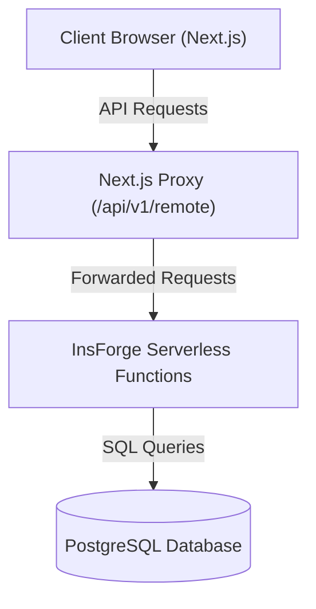
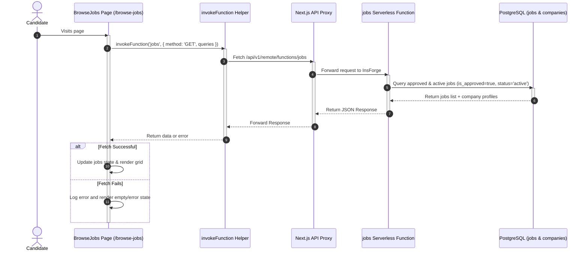
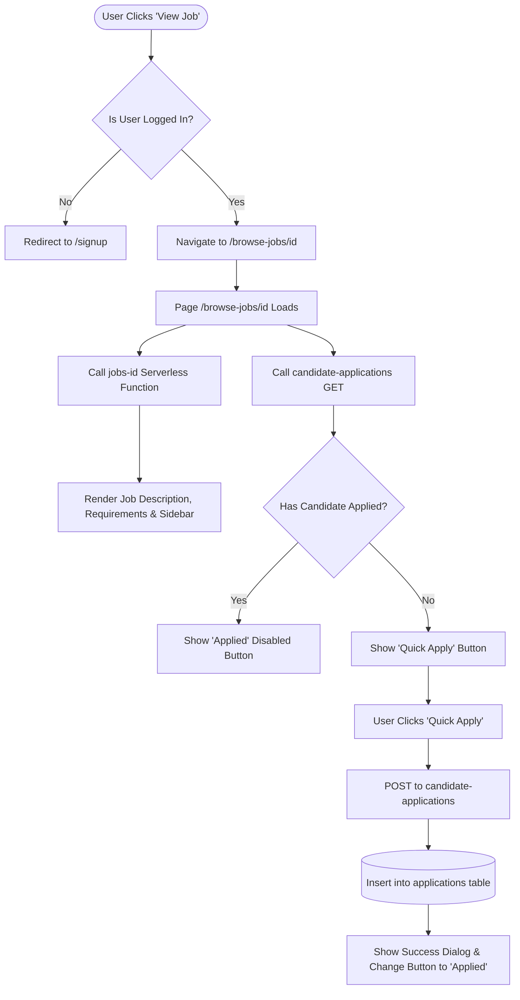
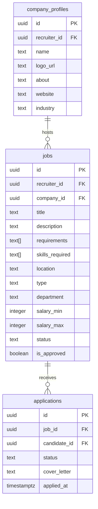

# Job Board Architecture and Flow Documentation

This document explains the technical architecture, data flows, and runtime behavior of the Job Board module in **TalentMesh**. It is designed to help any new developer understand how jobs are listed, searched, viewed, and applied to, and how the frontend interacts with the serverless backend.

---

## 1. System Overview

The Job Board module consists of a **Next.js frontend** that communicates with the **InsForge serverless backend** and **PostgreSQL database**. 



### Key Components:
* **Frontend Router Pages**:
  * `/browse-jobs` ([app/browse-jobs/page.tsx](file:///c:/Users/Anuj/Desktop/Talentmesh-AI-Recruiting-/app/browse-jobs/page.tsx)): Main portal to list, filter, search, and browse active jobs.
  * `/browse-jobs/[id]` ([app/browse-jobs/[id]/page.tsx](file:///c:/Users/Anuj/Desktop/Talentmesh-AI-Recruiting-/app/browse-jobs/%5Bid%5D/page.tsx)): Detail page showing a single job's description, requirements, company info, and quick apply actions.
* **Serverless Functions**:
  * `jobs` (`insforge/functions/jobs/index.ts`): Handles querying multi-record lists of jobs with filters or creating jobs.
  * `jobs-id` (`insforge/functions/jobs-id/index.ts`): Handles loading a single job's complete information.
  * `candidate-applications` (`insforge/functions/candidate-applications/index.ts`): Verifies if a user has applied, and processes new job applications.
* **Database Tables**:
  * `jobs`: Stores details about the job listings.
  * `company_profiles`: Stores information about hiring organizations.
  * `applications`: Tracks which candidate applied to which job and their review status.

---

## 2. Page Flow: Browse Jobs (`/browse-jobs`)

When a user visits the `/browse-jobs` page, the page queries the database dynamically instead of reading static mock data.



### Search & Filtering Logic
Filtering is processed using Next.js `useMemo` on the state returned by the database. The client filters the data locally based on:
1. **Search input**: Matches title, description, or company name.
2. **Location input**: Matches city, state, or remote options.
3. **Category chips**: Matches specific department types (e.g. Engineering, Design).
4. **Sidebar filters**: Multi-selection of job types (Full-Time, Contract) and industries.

---

## 3. Page Flow: "View Job" & Apply (`/browse-jobs/[id]`)

Clicking the **"View Job"** button triggers authentication checks, details loading, and application tracking flows.

### Interaction Flowchart



### API Detail: Fetching Job Details
When loading `/browse-jobs/[id]`, the page fetches the specific job details by matching the UUID:
```typescript
const { data, error } = await invokeFunction('jobs-id', {
    method: 'GET',
    queries: { id: jobId }
});
```
The serverless function `jobs-id` executes a secure lookup using the InsForge client:
```sql
SELECT id, title, description, requirements, skills_required, type, location, 
       salary_min, salary_max, currency, status, is_approved, company_id, 
       companies(id, name, logo_url, industry, description, website)
FROM jobs
WHERE id = :jobId AND is_approved = true AND status = 'active'
LIMIT 1;
```

---

## 4. Database Schema Relationships

The three main tables involved in the Job Board module are structured as follows:



### Relevant RLS (Row Level Security) Policies
To ensure security, PostgreSQL RLS policies enforce access control on the `jobs` table:
* **Select public jobs**: Any user can select a job if it is active and approved.
  ```sql
  CREATE POLICY "jobs_select_approved" ON public.jobs FOR SELECT 
  USING (status = 'active' AND is_approved = true);
  ```
* **Select recruiter jobs**: Recruiter can read all their own jobs regardless of state.
  ```sql
  CREATE POLICY "jobs_select_own" ON public.jobs FOR SELECT 
  USING (auth.uid() = recruiter_id);
  ```
* **Insert/Update/Delete recruiter jobs**: Allowed only if the user is the recruiter who owns the posting.
  ```sql
  CREATE POLICY "jobs_insert_own" ON public.jobs FOR INSERT WITH CHECK (auth.uid() = recruiter_id);
  CREATE POLICY "jobs_update_own" ON public.jobs FOR UPDATE USING (auth.uid() = recruiter_id);
  ```
